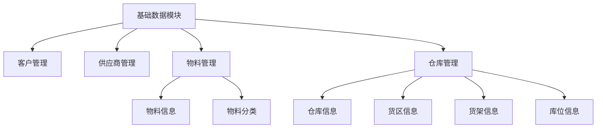
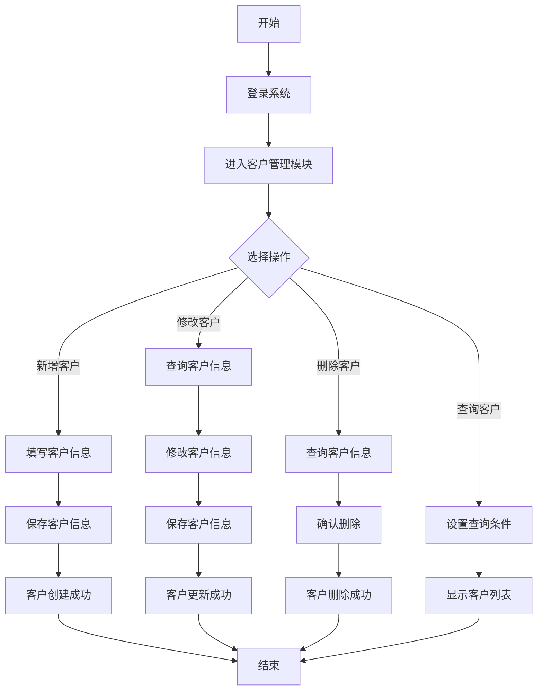
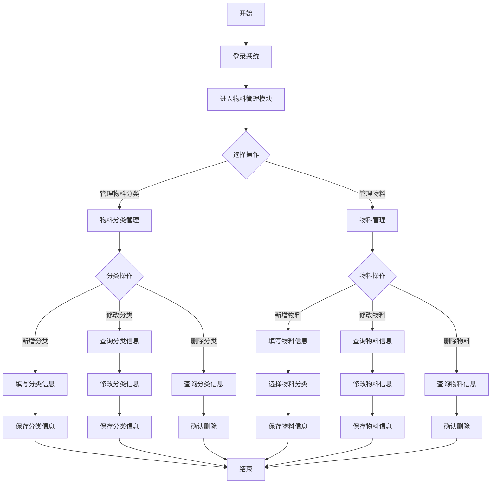
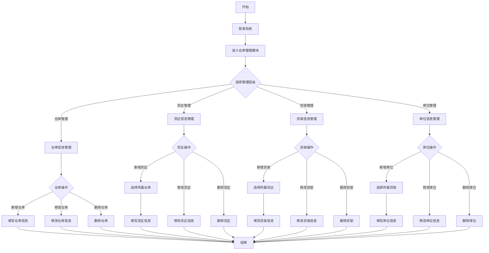

# 📦 WMS 基础数据模块设计文档



## 📋 目录

- [模块概述](#模块概述)
- [功能设计](#功能设计)
- [数据模型](#数据模型)
- [业务流程](#业务流程)
- [错误码定义](#错误码定义)
- [接口设计](#接口设计)
- [前端界面](#前端界面)

## 🎯 模块概述

基础数据模块是 WMS 系统的基础组件，负责管理系统中各类主数据，包括客户、供应商、物料、仓库、库位等信息。这些数据为 WMS 系统的其他功能模块提供基础支持，是保证系统正常运行的关键要素。

### 核心功能

- 客户信息管理：维护客户基本资料
- 供应商信息管理：维护供应商基本资料
- 物料信息管理：维护物料及物料分类信息
- 仓储结构管理：维护仓库、货区、货架、库位等仓储空间结构

## 🔍 功能设计

### 1. 客户管理

#### 功能描述

- 创建、修改、查询、删除客户信息
- 维护客户编码、名称、级别、联系方式等基本属性
- 维护客户的状态（正常/禁用）
- 导入导出客户数据

#### 业务规则

- 客户编码全局唯一，不可重复
- 客户级别分为普通客户(0)、重要客户(1)、VIP 客户(2)
- 客户状态包括正常(0)和禁用(1)
- 新建客户默认状态为正常

### 2. 供应商管理

#### 功能描述

- 创建、修改、查询、删除供应商信息
- 维护供应商编码、名称、级别、联系方式等基本属性
- 维护供应商的状态（正常/禁用）
- 导入导出供应商数据

#### 业务规则

- 供应商编码全局唯一，不可重复
- 供应商级别分为普通供应商(0)、重要供应商(1)、战略供应商(2)
- 供应商状态包括正常(0)和禁用(1)
- 新建供应商默认状态为正常

### 3. 物料管理

#### 功能描述

- 创建、修改、查询、删除物料分类
- 创建、修改、查询、删除物料信息
- 维护物料编码、名称、规格、单位、物料类型等属性
- 设置物料的安全库存、物料价格
- 导入导出物料数据

#### 业务规则

- 物料编码全局唯一，不可重复
- 物料必须关联物料分类
- 物料类型包括原材料(0)、半成品(1)、成品(2)、包装材料(3)等
- 物料状态包括正常(0)和禁用(1)
- 可设置物料安全库存，用于库存预警

### 4. 仓库管理

#### 功能描述

- 创建、修改、查询、删除仓库信息
- 创建、修改、查询、删除货区信息
- 创建、修改、查询、删除货架信息
- 创建、修改、查询、删除库位信息
- 维护仓库结构的层级关系
- 设置库位属性和状态

#### 业务规则

- 仓库编码全局唯一，不可重复
- 仓库类型包括原材料仓(0)、成品仓(1)、半成品仓(2)、退货仓(3)等
- 仓库、货区、货架、库位构成 4 级层级结构
- 库位状态包括空闲(0)、占用(1)、锁定(2)、禁用(3)
- 新建库位默认状态为空闲

## 📊 数据模型

### 1. 客户表(wms_customer)

| 字段名         | 数据类型     | 是否必填 | 描述     |
| -------------- | ------------ | -------- | -------- |
| id             | bigint(20)   | 是       | 主键 ID  |
| customer_code  | varchar(64)  | 是       | 客户编码 |
| customer_name  | varchar(255) | 是       | 客户名称 |
| customer_level | tinyint(4)   | 是       | 客户级别 |
| contact        | varchar(64)  | 否       | 联系人   |
| phone          | varchar(32)  | 否       | 联系电话 |
| email          | varchar(64)  | 否       | 邮箱     |
| address        | varchar(255) | 否       | 地址     |
| bank_name      | varchar(255) | 否       | 开户银行 |
| bank_account   | varchar(255) | 否       | 银行账号 |
| status         | tinyint(4)   | 是       | 状态     |
| remark         | varchar(512) | 否       | 备注     |
| creator        | varchar(64)  | 是       | 创建人   |
| create_time    | datetime     | 是       | 创建时间 |
| updater        | varchar(64)  | 是       | 更新人   |
| update_time    | datetime     | 是       | 更新时间 |
| deleted        | bit(1)       | 是       | 是否删除 |
| tenant_id      | bigint(20)   | 是       | 租户编号 |

### 2. 供应商表(wms_supplier)

| 字段名         | 数据类型     | 是否必填 | 描述       |
| -------------- | ------------ | -------- | ---------- |
| id             | bigint(20)   | 是       | 主键 ID    |
| supplier_code  | varchar(64)  | 是       | 供应商编码 |
| supplier_name  | varchar(255) | 是       | 供应商名称 |
| supplier_level | tinyint(4)   | 是       | 供应商级别 |
| contact        | varchar(64)  | 否       | 联系人     |
| phone          | varchar(32)  | 否       | 联系电话   |
| email          | varchar(64)  | 否       | 邮箱       |
| address        | varchar(255) | 否       | 地址       |
| bank_name      | varchar(255) | 否       | 开户银行   |
| bank_account   | varchar(255) | 否       | 银行账号   |
| status         | tinyint(4)   | 是       | 状态       |
| remark         | varchar(512) | 否       | 备注       |
| creator        | varchar(64)  | 是       | 创建人     |
| create_time    | datetime     | 是       | 创建时间   |
| updater        | varchar(64)  | 是       | 更新人     |
| update_time    | datetime     | 是       | 更新时间   |
| deleted        | bit(1)       | 是       | 是否删除   |
| tenant_id      | bigint(20)   | 是       | 租户编号   |

### 3. 物料分类表(wms_item_category)

| 字段名        | 数据类型     | 是否必填 | 描述        |
| ------------- | ------------ | -------- | ----------- |
| id            | bigint(20)   | 是       | 主键 ID     |
| category_code | varchar(64)  | 是       | 分类编码    |
| category_name | varchar(255) | 是       | 分类名称    |
| parent_id     | bigint(20)   | 是       | 父级分类 ID |
| status        | tinyint(4)   | 是       | 状态        |
| sort          | int(11)      | 是       | 显示顺序    |
| remark        | varchar(512) | 否       | 备注        |
| creator       | varchar(64)  | 是       | 创建人      |
| create_time   | datetime     | 是       | 创建时间    |
| updater       | varchar(64)  | 是       | 更新人      |
| update_time   | datetime     | 是       | 更新时间    |
| deleted       | bit(1)       | 是       | 是否删除    |
| tenant_id     | bigint(20)   | 是       | 租户编号    |

### 4. 物料表(wms_item)

| 字段名       | 数据类型      | 是否必填 | 描述       |
| ------------ | ------------- | -------- | ---------- |
| id           | bigint(20)    | 是       | 主键 ID    |
| item_code    | varchar(64)   | 是       | 物料编码   |
| item_name    | varchar(255)  | 是       | 物料名称   |
| category_id  | bigint(20)    | 是       | 分类 ID    |
| item_type    | tinyint(4)    | 是       | 物料类型   |
| spec         | varchar(255)  | 否       | 规格       |
| unit         | varchar(64)   | 否       | 单位       |
| weight       | decimal(10,2) | 否       | 重量       |
| volume       | decimal(10,2) | 否       | 体积       |
| bar_code     | varchar(64)   | 否       | 条码       |
| shelf_life   | int(11)       | 否       | 保质期(天) |
| safety_stock | int(11)       | 否       | 安全库存   |
| status       | tinyint(4)    | 是       | 状态       |
| remark       | varchar(512)  | 否       | 备注       |
| creator      | varchar(64)   | 是       | 创建人     |
| create_time  | datetime      | 是       | 创建时间   |
| updater      | varchar(64)   | 是       | 更新人     |
| update_time  | datetime      | 是       | 更新时间   |
| deleted      | bit(1)        | 是       | 是否删除   |
| tenant_id    | bigint(20)    | 是       | 租户编号   |

### 5. 仓库表(wms_warehouse)

| 字段名         | 数据类型      | 是否必填 | 描述         |
| -------------- | ------------- | -------- | ------------ |
| id             | bigint(20)    | 是       | 主键 ID      |
| warehouse_code | varchar(64)   | 是       | 仓库编码     |
| warehouse_name | varchar(255)  | 是       | 仓库名称     |
| warehouse_type | tinyint(4)    | 是       | 仓库类型     |
| address        | varchar(255)  | 否       | 地址         |
| area           | decimal(10,2) | 否       | 面积(平方米) |
| charge_person  | varchar(64)   | 否       | 负责人       |
| status         | tinyint(4)    | 是       | 状态         |
| remark         | varchar(512)  | 否       | 备注         |
| creator        | varchar(64)   | 是       | 创建人       |
| create_time    | datetime      | 是       | 创建时间     |
| updater        | varchar(64)   | 是       | 更新人       |
| update_time    | datetime      | 是       | 更新时间     |
| deleted        | bit(1)        | 是       | 是否删除     |
| tenant_id      | bigint(20)    | 是       | 租户编号     |

### 6. 货区表(wms_area)

| 字段名       | 数据类型     | 是否必填 | 描述        |
| ------------ | ------------ | -------- | ----------- |
| id           | bigint(20)   | 是       | 主键 ID     |
| area_code    | varchar(64)  | 是       | 货区编码    |
| area_name    | varchar(255) | 是       | 货区名称    |
| warehouse_id | bigint(20)   | 是       | 所属仓库 ID |
| area_type    | tinyint(4)   | 是       | 货区类型    |
| status       | tinyint(4)   | 是       | 状态        |
| remark       | varchar(512) | 否       | 备注        |
| creator      | varchar(64)  | 是       | 创建人      |
| create_time  | datetime     | 是       | 创建时间    |
| updater      | varchar(64)  | 是       | 更新人      |
| update_time  | datetime     | 是       | 更新时间    |
| deleted      | bit(1)       | 是       | 是否删除    |
| tenant_id    | bigint(20)   | 是       | 租户编号    |

### 7. 货架表(wms_rack)

| 字段名      | 数据类型     | 是否必填 | 描述        |
| ----------- | ------------ | -------- | ----------- |
| id          | bigint(20)   | 是       | 主键 ID     |
| rack_code   | varchar(64)  | 是       | 货架编码    |
| rack_name   | varchar(255) | 是       | 货架名称    |
| area_id     | bigint(20)   | 是       | 所属货区 ID |
| rack_type   | tinyint(4)   | 是       | 货架类型    |
| status      | tinyint(4)   | 是       | 状态        |
| remark      | varchar(512) | 否       | 备注        |
| creator     | varchar(64)  | 是       | 创建人      |
| create_time | datetime     | 是       | 创建时间    |
| updater     | varchar(64)  | 是       | 更新人      |
| update_time | datetime     | 是       | 更新时间    |
| deleted     | bit(1)       | 是       | 是否删除    |
| tenant_id   | bigint(20)   | 是       | 租户编号    |

### 8. 库位表(wms_location)

| 字段名        | 数据类型     | 是否必填 | 描述        |
| ------------- | ------------ | -------- | ----------- |
| id            | bigint(20)   | 是       | 主键 ID     |
| location_code | varchar(64)  | 是       | 库位编码    |
| location_name | varchar(255) | 是       | 库位名称    |
| rack_id       | bigint(20)   | 是       | 所属货架 ID |
| location_type | tinyint(4)   | 是       | 库位类型    |
| status        | tinyint(4)   | 是       | 状态        |
| remark        | varchar(512) | 否       | 备注        |
| creator       | varchar(64)  | 是       | 创建人      |
| create_time   | datetime     | 是       | 创建时间    |
| updater       | varchar(64)  | 是       | 更新人      |
| update_time   | datetime     | 是       | 更新时间    |
| deleted       | bit(1)       | 是       | 是否删除    |
| tenant_id     | bigint(20)   | 是       | 租户编号    |

## 🔄 业务流程

### 1. 客户管理业务流程



### 2. 物料管理业务流程



### 3. 仓库层级管理流程



## 🔌 接口设计

### 1. 客户管理接口

#### 获取客户列表

- **接口路径**: `/wms/customer/page`
- **请求方式**: GET
- **请求参数**:
  - customerCode: 客户编码（可选）
  - customerName: 客户名称（可选）
  - customerLevel: 客户级别（可选）
  - status: 状态（可选）
  - pageNo: 页码（必填）
  - pageSize: 每页记录数（必填）
- **响应结果**:
  ```json
  {
    "code": 0,
    "data": {
      "list": [
        {
          "id": 1,
          "customerCode": "CUST001",
          "customerName": "示例客户",
          "customerLevel": 1,
          "contact": "张三",
          "phone": "13800138000",
          "email": "zhangsan@example.com",
          "address": "北京市朝阳区",
          "status": 0,
          "createTime": "2023-01-01 12:00:00"
        }
      ],
      "total": 1
    },
    "msg": "操作成功"
  }
  ```

#### 获取客户详情

- **接口路径**: `/wms/customer/get`
- **请求方式**: GET
- **请求参数**:
  - id: 客户 ID（必填）
- **响应结果**:
  ```json
  {
    "code": 0,
    "data": {
      "id": 1,
      "customerCode": "CUST001",
      "customerName": "示例客户",
      "customerLevel": 1,
      "contact": "张三",
      "phone": "13800138000",
      "email": "zhangsan@example.com",
      "address": "北京市朝阳区",
      "bankName": "中国银行",
      "bankAccount": "123456789012345678",
      "status": 0,
      "remark": "备注信息",
      "createTime": "2023-01-01 12:00:00",
      "updateTime": "2023-01-02 12:00:00"
    },
    "msg": "操作成功"
  }
  ```

#### 创建客户

- **接口路径**: `/wms/customer/create`
- **请求方式**: POST
- **请求参数**:
  ```json
  {
    "customerCode": "CUST002",
    "customerName": "新客户",
    "customerLevel": 0,
    "contact": "李四",
    "phone": "13900139000",
    "email": "lisi@example.com",
    "address": "上海市浦东新区",
    "bankName": "中国工商银行",
    "bankAccount": "987654321098765432",
    "status": 0,
    "remark": "新增客户"
  }
  ```
- **响应结果**:
  ```json
  {
    "code": 0,
    "data": true,
    "msg": "操作成功"
  }
  ```

#### 更新客户

- **接口路径**: `/wms/customer/update`
- **请求方式**: PUT
- **请求参数**:
  ```json
  {
    "id": 1,
    "customerCode": "CUST001",
    "customerName": "修改后的客户名称",
    "customerLevel": 2,
    "contact": "张三",
    "phone": "13800138000",
    "email": "zhangsan@example.com",
    "address": "北京市朝阳区",
    "bankName": "中国银行",
    "bankAccount": "123456789012345678",
    "status": 0,
    "remark": "更新备注"
  }
  ```
- **响应结果**:
  ```json
  {
    "code": 0,
    "data": true,
    "msg": "操作成功"
  }
  ```

#### 删除客户

- **接口路径**: `/wms/customer/delete`
- **请求方式**: DELETE
- **请求参数**:
  - id: 客户 ID（必填）
- **响应结果**:
  ```json
  {
    "code": 0,
    "data": true,
    "msg": "操作成功"
  }
  ```

### 2. 物料管理接口

类似客户管理接口，此处省略详细接口定义...

### 3. 仓库管理接口

类似客户管理接口，此处省略详细接口定义...

## 💻 前端界面

### 1. 客户管理界面

#### 客户列表页


- **功能说明**:
  - 顶部搜索区：提供客户编码、名称、级别、状态等搜索条件
  - 操作按钮区：新增、导出等操作按钮
  - 数据表格区：显示客户列表数据，包括编码、名称、级别、联系人等字段
  - 表格操作列：编辑、删除等操作按钮
  - 分页控件：控制分页显示

#### 客户编辑页


- **功能说明**:
  - 表单区：包含客户编码、名称、级别、联系方式等输入字段
  - 按钮区：保存、取消等操作按钮
  - 验证规则：客户编码、名称等必填项验证

### 2. 物料管理界面

#### 物料分类管理页


- **功能说明**:
  - 左侧树形结构：显示物料分类层级关系
  - 右侧详情区：显示和编辑选中分类的详细信息
  - 操作按钮：添加子分类、编辑、删除等操作

#### 物料列表页


- **功能说明**:
  - 顶部搜索区：提供物料编码、名称、分类、类型等搜索条件
  - 操作按钮区：新增、导出等操作按钮
  - 数据表格区：显示物料列表数据，包括编码、名称、分类、规格等字段
  - 表格操作列：编辑、删除等操作按钮
  - 分页控件：控制分页显示

### 3. 仓库管理界面

#### 仓库结构管理页


- **功能说明**:
  - 顶部操作区：切换不同层级（仓库/货区/货架/库位）的标签页
  - 数据展示区：以表格或树形结构展示仓库层级关系
  - 层级选择区：级联选择仓库、货区、货架等

## ❌ 错误码定义

错误码编号规则说明：

1. 第 1 位：系统分类（1=业务系统）
2. 第 2-4 位：模块编号（002=WMS 模块）
3. 第 5-7 位：子模块编号
   - 000xxx：基础数据（客户、供应商）
   - 001xxx：物料与分类
   - 002xxx：仓库与库位
   - 003xxx：批次管理
   - 004xxx：库存管理
   - 005xxx：入库管理
   - 006xxx：出库管理
   - 007xxx：移库管理
4. 第 8-10 位：具体错误编号（001、002、003...）

### 1. 基础数据错误码 (1002000xxx)

#### 1.1 客户管理错误码

```java
// 客户不存在
ErrorCode CUSTOMER_NOT_EXISTS = new ErrorCode(1002000001, "客户不存在");
// 客户编码已存在
ErrorCode CUSTOMER_CODE_EXISTS = new ErrorCode(1002000002, "客户编码已存在");
// 客户状态异常
ErrorCode CUSTOMER_STATUS_ERROR = new ErrorCode(1002000003, "客户状态异常");
```

#### 1.2 供应商管理错误码

```java
// 供应商不存在
ErrorCode SUPPLIER_NOT_EXISTS = new ErrorCode(1002000101, "供应商不存在");
// 供应商编码已存在
ErrorCode SUPPLIER_CODE_EXISTS = new ErrorCode(1002000102, "供应商编码已存在");
// 供应商状态异常
ErrorCode SUPPLIER_STATUS_ERROR = new ErrorCode(1002000103, "供应商状态异常");
```

### 2. 物料与分类错误码 (1002001xxx)

#### 2.1 物料管理错误码

```java
// 物料不存在
ErrorCode ITEM_NOT_EXISTS = new ErrorCode(1002001001, "物料不存在");
// 物料编码已存在
ErrorCode ITEM_CODE_EXISTS = new ErrorCode(1002001002, "物料编码已存在");
// 物料状态异常
ErrorCode ITEM_STATUS_ERROR = new ErrorCode(1002001003, "物料状态异常");
```

#### 2.2 物料分类错误码

```java
// 物料分类不存在
ErrorCode ITEM_CATEGORY_NOT_EXISTS = new ErrorCode(1002001101, "物料分类不存在");
// 物料分类编码已存在
ErrorCode ITEM_CATEGORY_CODE_EXISTS = new ErrorCode(1002001102, "物料分类编码已存在");
// 物料分类下存在子分类
ErrorCode ITEM_CATEGORY_HAS_CHILDREN = new ErrorCode(1002001103, "物料分类下存在子分类");
// 物料分类下存在物料
ErrorCode ITEM_CATEGORY_HAS_ITEMS = new ErrorCode(1002001104, "物料分类下存在物料");
```

### 3. 仓库与库位错误码 (1002002xxx)

#### 3.1 仓库管理错误码

```java
// 仓库不存在
ErrorCode WAREHOUSE_NOT_EXISTS = new ErrorCode(1002002001, "仓库不存在");
// 仓库编码已存在
ErrorCode WAREHOUSE_CODE_EXISTS = new ErrorCode(1002002002, "仓库编码已存在");
// 仓库状态异常
ErrorCode WAREHOUSE_STATUS_ERROR = new ErrorCode(1002002003, "仓库状态异常");
```

#### 3.2 货区管理错误码

```java
// 货区不存在
ErrorCode AREA_NOT_EXISTS = new ErrorCode(1002002101, "货区不存在");
// 货区编码已存在
ErrorCode AREA_CODE_EXISTS = new ErrorCode(1002002102, "货区编码已存在");
// 货区状态异常
ErrorCode AREA_STATUS_ERROR = new ErrorCode(1002002103, "货区状态异常");
```

#### 3.3 货架管理错误码

```java
// 货架不存在
ErrorCode RACK_NOT_EXISTS = new ErrorCode(1002002201, "货架不存在");
// 货架编码已存在
ErrorCode RACK_CODE_EXISTS = new ErrorCode(1002002202, "货架编码已存在");
// 货架状态异常
ErrorCode RACK_STATUS_ERROR = new ErrorCode(1002002203, "货架状态异常");
```

#### 3.4 库位管理错误码

```java
// 库位不存在
ErrorCode LOCATION_NOT_EXISTS = new ErrorCode(1002002301, "库位不存在");
// 库位编码已存在
ErrorCode LOCATION_CODE_EXISTS = new ErrorCode(1002002302, "库位编码已存在");
// 库位状态异常
ErrorCode LOCATION_STATUS_ERROR = new ErrorCode(1002002303, "库位状态异常");
// 库位已被占用
ErrorCode LOCATION_OCCUPIED = new ErrorCode(1002002304, "库位已被占用");
```

### 4. 批次管理错误码 (1002003xxx)

```java
// 批次不存在
ErrorCode BATCH_NOT_EXISTS = new ErrorCode(1002003001, "批次不存在");
// 批次编码已存在
ErrorCode BATCH_CODE_EXISTS = new ErrorCode(1002003002, "批次编码已存在");
// 批次状态异常
ErrorCode BATCH_STATUS_ERROR = new ErrorCode(1002003003, "批次状态异常");
// 批次已过期
ErrorCode BATCH_EXPIRED = new ErrorCode(1002003004, "批次已过期");
// 批次库存不存在
ErrorCode BATCH_INVENTORY_NOT_EXISTS = new ErrorCode(1002003101, "批次库存不存在");
// 批次记录不存在
ErrorCode BATCH_RECORD_NOT_EXISTS = new ErrorCode(1002003201, "批次记录不存在");
```

### 5. 库存管理错误码 (1002004xxx)

#### 5.1 库存错误码

```java
// 库存不存在
ErrorCode INVENTORY_NOT_EXISTS = new ErrorCode(1002004001, "库存不存在");
// 库存不足
ErrorCode INVENTORY_INSUFFICIENT = new ErrorCode(1002004002, "库存不足");
// 库存已冻结
ErrorCode INVENTORY_FROZEN = new ErrorCode(1002004003, "库存已冻结");
```

#### 5.2 盘点管理错误码

```java
// 盘点单不存在
ErrorCode INVENTORY_CHECK_NOT_EXISTS = new ErrorCode(1002004101, "盘点单不存在");
// 盘点单状态异常
ErrorCode INVENTORY_CHECK_STATUS_ERROR = new ErrorCode(1002004102, "盘点单状态异常");
// 盘点单明细不存在
ErrorCode INVENTORY_CHECK_DETAIL_NOT_EXISTS = new ErrorCode(1002004103, "盘点单明细不存在");
```

#### 5.3 库存移动错误码

```java
// 库存移动不存在
ErrorCode INVENTORY_MOVEMENT_NOT_EXISTS = new ErrorCode(1002004201, "库存移动不存在");
// 库存移动状态异常
ErrorCode INVENTORY_MOVEMENT_STATUS_ERROR = new ErrorCode(1002004202, "库存移动状态异常");
```

### 6. 入库管理错误码 (1002005xxx)

```java
// 入库单不存在
ErrorCode RECEIPT_ORDER_NOT_EXISTS = new ErrorCode(1002005001, "入库单不存在");
// 入库单状态异常
ErrorCode RECEIPT_ORDER_STATUS_ERROR = new ErrorCode(1002005002, "入库单状态异常");
// 入库单明细不存在
ErrorCode RECEIPT_ORDER_DETAIL_NOT_EXISTS = new ErrorCode(1002005101, "入库单明细不存在");
// 入库记录不存在
ErrorCode RECEIPT_RECORD_NOT_EXISTS = new ErrorCode(1002005201, "入库记录不存在");
```

### 7. 出库管理错误码 (1002006xxx)

```java
// 出库单不存在
ErrorCode SHIPMENT_ORDER_NOT_EXISTS = new ErrorCode(1002006001, "出库单不存在");
// 出库单状态异常
ErrorCode SHIPMENT_ORDER_STATUS_ERROR = new ErrorCode(1002006002, "出库单状态异常");
// 出库单明细不存在
ErrorCode SHIPMENT_ORDER_DETAIL_NOT_EXISTS = new ErrorCode(1002006101, "出库单明细不存在");
// 出库记录不存在
ErrorCode SHIPMENT_RECORD_NOT_EXISTS = new ErrorCode(1002006201, "出库记录不存在");
```

### 8. 移库管理错误码 (1002007xxx)

```java
// 移库单不存在
ErrorCode MOVE_ORDER_NOT_EXISTS = new ErrorCode(1002007001, "移库单不存在");
// 移库单状态异常
ErrorCode MOVE_ORDER_STATUS_ERROR = new ErrorCode(1002007002, "移库单状态异常");
// 移库单明细不存在
ErrorCode MOVE_ORDER_DETAIL_NOT_EXISTS = new ErrorCode(1002007101, "移库单明细不存在");
// 移库记录不存在
ErrorCode MOVE_RECORD_NOT_EXISTS = new ErrorCode(1002007201, "移库记录不存在");
```
