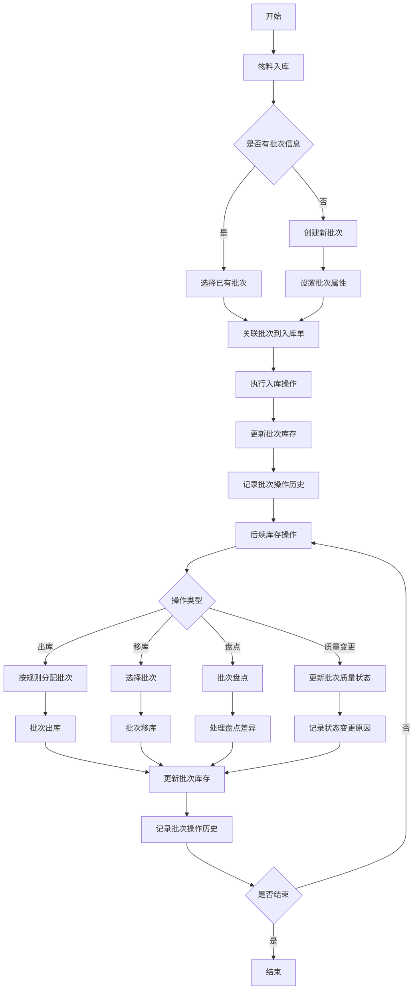
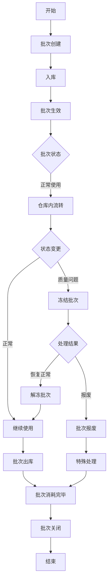
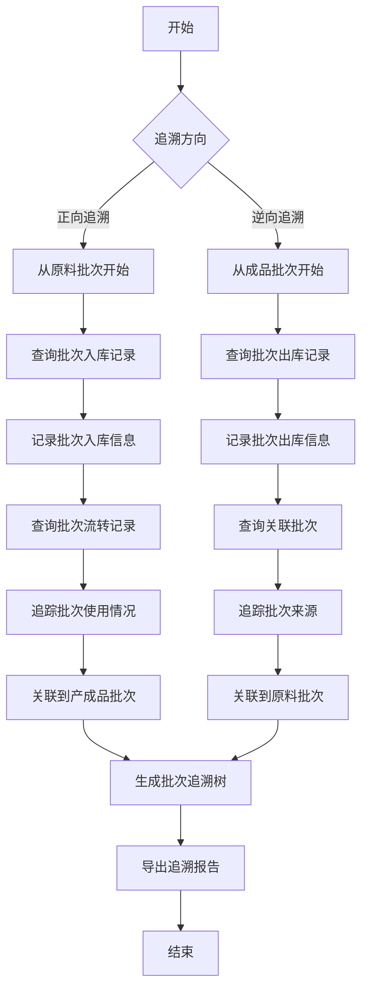
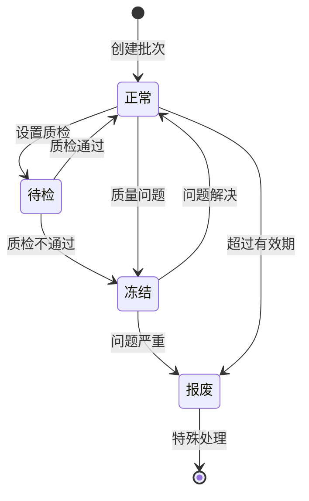

# 🏷️ WMS 批次管理模块设计文档


## 📋 目录

- [模块概述](#模块概述)
- [功能设计](#功能设计)
- [数据模型](#数据模型)
- [业务流程](#业务流程)
- [批次追溯](#批次追溯)
- [接口设计](#接口设计)
- [前端界面](#前端界面)

## 🎯 模块概述

批次管理模块是 WMS 系统中负责管理物料批次信息的功能模块，用于追踪和管理同一物料不同批次的库存情况。通过批次管理，可以实现物料的先进先出、保质期管理、批次追溯等功能，满足食品、医药等行业对批次管理的高要求。

### 核心功能

- 批次信息管理：创建、修改、查询批次信息
- 批次库存管理：查询各批次库存，支持批次级别的库存操作
- 批次追溯管理：追溯批次从入库到出库的全过程
- 保质期管理：监控批次的生产日期、有效期，预警即将过期的批次
- 批次质量管理：记录和管理批次的质量状态

## 🔍 功能设计

### 1. 批次信息管理

#### 功能描述

- 创建、修改、查询、删除批次信息
- 记录批次的基本属性：批次号、生产日期、保质期、有效期等
- 设置批次的质量状态：正常、待检、冻结等
- 批次与物料的关联管理

#### 业务规则

- 批次号在系统内全局唯一，不可重复
- 批次可以手动创建，也可以在入库时自动生成
- 批次状态包括：正常(0)、待检(1)、冻结(2)、报废(3)
- 批次一旦被使用（关联库存），核心属性不可修改
- 保质期天数和生产日期共同决定批次的有效期

### 2. 批次库存管理

#### 功能描述

- 查询各批次的库存数量及分布
- 支持按批次维度的库存锁定和解锁
- 在出入库操作中选择或录入批次信息
- 支持批次库存报表统计

#### 业务规则

- 入库时必须指定批次，若不存在则自动创建
- 出库时支持按先进先出、近效期优先等策略自动分配批次
- 库存移动时批次信息跟随库存一起移动
- 库存盘点时需要精确到批次级别

### 3. 批次追溯管理

#### 功能描述

- 追溯批次从入库到出库的全过程
- 记录批次的每次库存变动情况
- 查询批次的当前库存及历史记录
- 支持批次质量问题的快速定位和召回

#### 业务规则

- 所有涉及批次的操作都必须记录到批次操作历史中
- 批次操作类型包括：入库(0)、出库(1)、移库(2)、调整(3)、质量状态变更(4)
- 批次追溯需要关联到具体的业务单据
- 批次追溯支持正向（从原料到成品）和逆向（从成品到原料）两种方式

### 4. 保质期管理

#### 功能描述

- 记录批次的生产日期和保质期天数
- 自动计算批次的有效期
- 按有效期进行库存预警
- 支持效期策略管理

#### 业务规则

- 有效期 = 生产日期 + 保质期天数
- 效期预警分为多级：正常、临近过期（黄色预警）、即将过期（红色预警）、已过期
- 预警天数可按物料类型或具体物料设置
- 过期批次默认不可用于出库，特殊情况下可强制使用

### 5. 批次质量管理

#### 功能描述

- 设置和修改批次的质量状态
- 提供批次质检功能，记录质检结果
- 支持批次的冻结和解冻操作
- 管理不合格批次的处理流程

#### 业务规则

- 批次质量状态变更需要记录原因和操作人
- 待检状态的批次不能用于出库
- 冻结状态的批次不能用于任何库存操作
- 报废状态的批次需要通过特殊流程处理

## 📊 数据模型

### 1. 批次信息表(wms_batch)

| 字段名          | 数据类型     | 是否必填 | 描述         |
| --------------- | ------------ | -------- | ------------ |
| id              | bigint(20)   | 是       | 主键 ID      |
| batch_code      | varchar(64)  | 是       | 批次号       |
| item_id         | bigint(20)   | 是       | 物料 ID      |
| item_code       | varchar(64)  | 是       | 物料编码     |
| item_name       | varchar(255) | 是       | 物料名称     |
| production_date | date         | 否       | 生产日期     |
| shelf_life      | int(11)      | 否       | 保质期(天)   |
| expiry_date     | date         | 否       | 有效期       |
| supplier_id     | bigint(20)   | 否       | 供应商 ID    |
| supplier_name   | varchar(255) | 否       | 供应商名称   |
| supplier_batch  | varchar(64)  | 否       | 供应商批次号 |
| status          | tinyint(4)   | 是       | 批次状态     |
| quality_status  | tinyint(4)   | 是       | 质量状态     |
| total_count     | int(11)      | 是       | 总数量       |
| available_count | int(11)      | 是       | 可用数量     |
| locked_count    | int(11)      | 是       | 锁定数量     |
| remark          | varchar(512) | 否       | 备注         |
| creator         | varchar(64)  | 是       | 创建人       |
| create_time     | datetime     | 是       | 创建时间     |
| updater         | varchar(64)  | 是       | 更新人       |
| update_time     | datetime     | 是       | 更新时间     |
| deleted         | bit(1)       | 是       | 是否删除     |
| tenant_id       | bigint(20)   | 是       | 租户编号     |

### 2. 批次库存表(wms_batch_inventory)

| 字段名          | 数据类型     | 是否必填 | 描述     |
| --------------- | ------------ | -------- | -------- |
| id              | bigint(20)   | 是       | 主键 ID  |
| batch_id        | bigint(20)   | 是       | 批次 ID  |
| batch_code      | varchar(64)  | 是       | 批次号   |
| inventory_id    | bigint(20)   | 是       | 库存 ID  |
| warehouse_id    | bigint(20)   | 是       | 仓库 ID  |
| warehouse_name  | varchar(255) | 是       | 仓库名称 |
| area_id         | bigint(20)   | 否       | 货区 ID  |
| area_name       | varchar(255) | 否       | 货区名称 |
| rack_id         | bigint(20)   | 否       | 货架 ID  |
| rack_name       | varchar(255) | 否       | 货架名称 |
| location_id     | bigint(20)   | 否       | 库位 ID  |
| location_name   | varchar(255) | 否       | 库位名称 |
| item_id         | bigint(20)   | 是       | 物料 ID  |
| item_code       | varchar(64)  | 是       | 物料编码 |
| item_name       | varchar(255) | 是       | 物料名称 |
| stock_count     | int(11)      | 是       | 库存总量 |
| available_count | int(11)      | 是       | 可用数量 |
| locked_count    | int(11)      | 是       | 锁定数量 |
| status          | tinyint(4)   | 是       | 状态     |
| remark          | varchar(512) | 否       | 备注     |
| creator         | varchar(64)  | 是       | 创建人   |
| create_time     | datetime     | 是       | 创建时间 |
| updater         | varchar(64)  | 是       | 更新人   |
| update_time     | datetime     | 是       | 更新时间 |
| deleted         | bit(1)       | 是       | 是否删除 |
| tenant_id       | bigint(20)   | 是       | 租户编号 |

### 3. 批次操作记录表(wms_batch_record)

| 字段名          | 数据类型     | 是否必填 | 描述            |
| --------------- | ------------ | -------- | --------------- |
| id              | bigint(20)   | 是       | 主键 ID         |
| batch_id        | bigint(20)   | 是       | 批次 ID         |
| batch_code      | varchar(64)  | 是       | 批次号          |
| operation_type  | tinyint(4)   | 是       | 操作类型        |
| order_id        | bigint(20)   | 否       | 关联单据 ID     |
| order_no        | varchar(64)  | 否       | 关联单据编号    |
| order_detail_id | bigint(20)   | 否       | 关联单据明细 ID |
| warehouse_id    | bigint(20)   | 是       | 仓库 ID         |
| warehouse_name  | varchar(255) | 是       | 仓库名称        |
| location_id     | bigint(20)   | 否       | 库位 ID         |
| location_name   | varchar(255) | 否       | 库位名称        |
| item_id         | bigint(20)   | 是       | 物料 ID         |
| item_code       | varchar(64)  | 是       | 物料编码        |
| item_name       | varchar(255) | 是       | 物料名称        |
| count           | int(11)      | 是       | 操作数量        |
| before_status   | tinyint(4)   | 否       | 操作前状态      |
| after_status    | tinyint(4)   | 否       | 操作后状态      |
| before_count    | int(11)      | 否       | 操作前数量      |
| after_count     | int(11)      | 否       | 操作后数量      |
| operation_time  | datetime     | 是       | 操作时间        |
| operator        | varchar(64)  | 是       | 操作人          |
| remark          | varchar(512) | 否       | 备注            |
| creator         | varchar(64)  | 是       | 创建人          |
| create_time     | datetime     | 是       | 创建时间        |
| updater         | varchar(64)  | 是       | 更新人          |
| update_time     | datetime     | 是       | 更新时间        |
| deleted         | bit(1)       | 是       | 是否删除        |
| tenant_id       | bigint(20)   | 是       | 租户编号        |

## 🔄 业务流程

### 批次管理业务流程



### 批次生命周期流程



## 🔍 批次追溯

### 批次追溯流程



### 批次状态流转



## 🔌 接口设计

### 1. 批次信息管理接口

#### 获取批次列表

- **接口路径**: `/wms/batch/page`
- **请求方式**: GET
- **请求参数**:
  - batchCode: 批次号（可选）
  - itemCode: 物料编码（可选）
  - itemName: 物料名称（可选）
  - status: 批次状态（可选）
  - qualityStatus: 质量状态（可选）
  - productionDate: 生产日期范围（可选）
  - expiryDate: 有效期范围（可选）
  - pageNo: 页码（必填）
  - pageSize: 每页记录数（必填）
- **响应结果**: 分页返回批次列表

#### 获取批次详情

- **接口路径**: `/wms/batch/get`
- **请求方式**: GET
- **请求参数**:
  - id: 批次 ID（必填）
- **响应结果**: 返回批次详情

#### 创建批次

- **接口路径**: `/wms/batch/create`
- **请求方式**: POST
- **请求参数**:
  ```json
  {
    "batchCode": "BT202301010001",
    "itemId": 1,
    "itemCode": "ITEM001",
    "itemName": "示例物料",
    "productionDate": "2023-01-01",
    "shelfLife": 365,
    "expiryDate": "2024-01-01",
    "supplierId": 1,
    "supplierName": "示例供应商",
    "supplierBatch": "S20230101",
    "status": 0,
    "qualityStatus": 0,
    "remark": "新批次"
  }
  ```
- **响应结果**: 创建成功返回批次 ID

#### 更新批次

- **接口路径**: `/wms/batch/update`
- **请求方式**: PUT
- **请求参数**: 与创建批次类似，增加 id 字段
- **响应结果**: 更新成功返回 true

#### 更新批次状态

- **接口路径**: `/wms/batch/update-status`
- **请求方式**: PUT
- **请求参数**:
  ```json
  {
    "id": 1,
    "status": 2,
    "remark": "质量问题，批次冻结"
  }
  ```
- **响应结果**: 更新成功返回 true

### 2. 批次库存管理接口

#### 获取批次库存列表

- **接口路径**: `/wms/batch-inventory/page`
- **请求方式**: GET
- **请求参数**:
  - batchCode: 批次号（可选）
  - itemCode: 物料编码（可选）
  - warehouseId: 仓库 ID（可选）
  - locationId: 库位 ID（可选）
  - pageNo: 页码（必填）
  - pageSize: 每页记录数（必填）
- **响应结果**: 分页返回批次库存列表

#### 获取批次库存详情

- **接口路径**: `/wms/batch-inventory/get`
- **请求方式**: GET
- **请求参数**:
  - id: 批次库存 ID（必填）
- **响应结果**: 返回批次库存详情

### 3. 批次追溯接口

#### 批次操作记录查询

- **接口路径**: `/wms/batch-record/page`
- **请求方式**: GET
- **请求参数**:
  - batchCode: 批次号（可选）
  - itemCode: 物料编码（可选）
  - operationType: 操作类型（可选）
  - operationTime: 操作时间范围（可选）
  - pageNo: 页码（必填）
  - pageSize: 每页记录数（必填）
- **响应结果**: 分页返回批次操作记录列表

#### 批次追溯查询

- **接口路径**: `/wms/batch/trace`
- **请求方式**: GET
- **请求参数**:
  - batchCode: 批次号（必填）
  - direction: 追溯方向(0-正向, 1-逆向)（必填）
- **响应结果**: 返回批次追溯结果树

### 4. 保质期管理接口

#### 保质期预警查询

- **接口路径**: `/wms/batch/expiry-warning`
- **请求方式**: GET
- **请求参数**:
  - warningDays: 预警天数（可选，默认 30 天）
  - warehouseId: 仓库 ID（可选）
  - pageNo: 页码（必填）
  - pageSize: 每页记录数（必填）
- **响应结果**: 分页返回即将过期的批次列表

## 💻 前端界面

### 1. 批次管理列表页

- **功能说明**:
  - 顶部搜索区：提供批次号、物料、状态、日期等搜索条件
  - 操作按钮区：新增、导出等操作按钮
  - 数据表格区：显示批次列表数据，包括批次号、物料、生产日期、有效期、状态等字段
  - 表格操作列：编辑、状态变更、查看详情等操作按钮
  - 分页控件：控制分页显示

### 2. 批次详情页

- **功能说明**:
  - 基本信息区：显示批次基本信息，包括批次号、物料、生产日期、有效期等
  - 库存信息区：显示该批次的库存分布情况
  - 操作记录区：显示该批次的所有操作历史
  - 状态变更区：提供状态变更操作界面
  - 操作按钮：变更状态、导出记录等操作按钮

### 3. 批次库存查询页

- **功能说明**:
  - 顶部搜索区：提供批次号、物料、仓库、库位等搜索条件
  - 数据表格区：显示批次库存数据，包括批次号、物料、仓库、库位、数量等字段
  - 库存状态标识：使用不同颜色标识不同状态的批次库存
  - 分页控件：控制分页显示

### 4. 批次追溯页面

- **功能说明**:
  - 批次选择区：输入批次号或扫描批次条码
  - 追溯方向选择：正向追溯或逆向追溯
  - 追溯结果展示区：以树形结构展示批次追溯结果
  - 追溯详情区：展示选中节点的详细信息
  - 操作按钮：导出追溯报告等操作按钮

### 5. 保质期预警页面

- **功能说明**:
  - 预警级别选择：设置不同预警级别的天数
  - 预警结果展示：展示即将过期的批次列表
  - 预警处理操作：提供批次处理的快捷操作
  - 统计图表：以图表形式展示保质期分布情况
