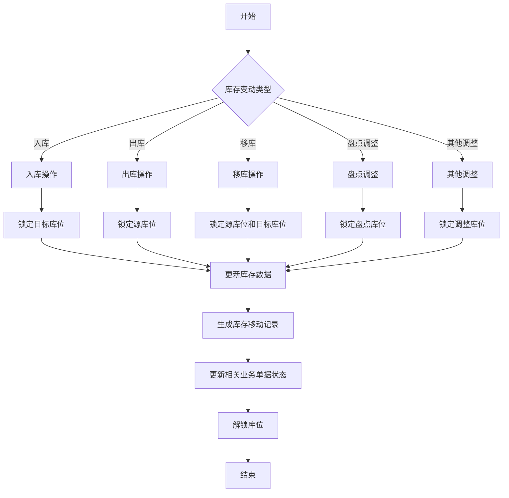
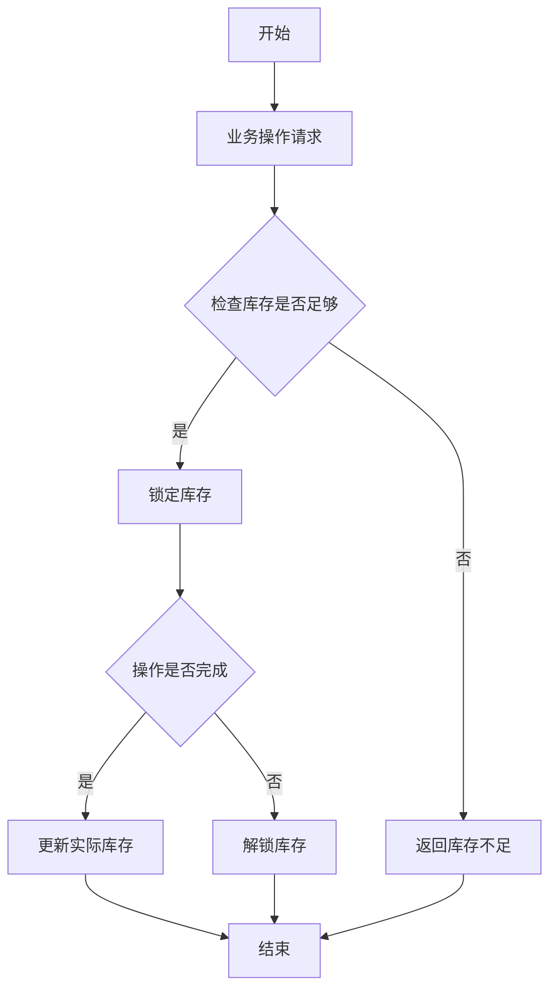
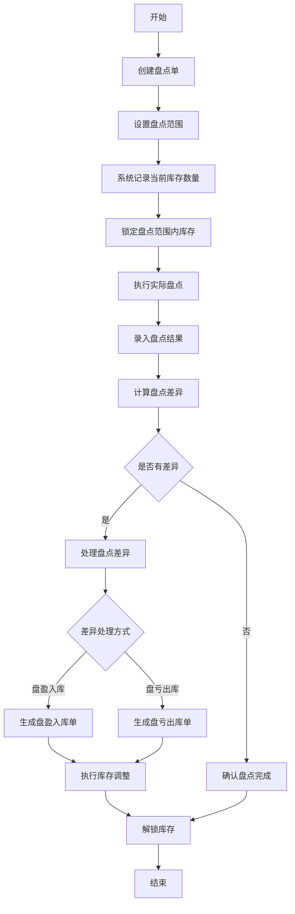
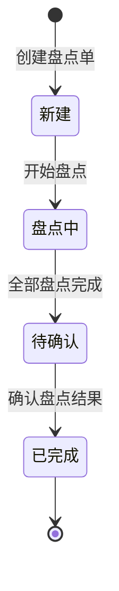

# 📊 WMS 库存管理模块设计文档

## 📋 目录

- [模块概述](#模块概述)
- [功能设计](#功能设计)
- [数据模型](#数据模型)
- [业务流程](#业务流程)
- [库存盘点](#库存盘点)
- [接口设计](#接口设计)

## 🎯 模块概述

库存管理模块是 WMS 系统的核心功能模块，负责管理和监控仓库中所有物料的实时库存状态。通过库存查询、库存移动记录、库存盘点等功能，确保系统中的库存数据与实际库存相符，并为管理决策提供准确的库存信息。

### 核心功能

- 库存查询：查询实时库存，包括总量、可用量、锁定量等
- 库存移动记录：记录所有库存变动，包括入库、出库、移库、调整等
- 库存盘点：创建盘点单，执行盘点，处理盘点差异
- 批次管理：按批次管理库存，支持批次级别的库存操作
- 库存预警：基于安全库存进行库存预警

## 🔍 功能设计

### 1. 库存查询

#### 功能描述

- 查询当前库存状态，包括库存总量、可用量、锁定量等
- 支持按仓库、货区、货架、库位等条件查询
- 支持按物料、物料分类等条件查询
- 支持按批次查询库存
- 查看库存明细，包括库存分布情况

#### 业务规则

- 库存总量 = 可用量 + 锁定量
- 支持库存多维度聚合查询
- 支持库存快照查询
- 库存数据实时更新

### 2. 库存移动记录

#### 功能描述

- 记录所有导致库存变动的操作
- 包括入库、出库、移库、盘点调整等类型
- 记录操作前后的库存数量
- 关联业务单据，便于追溯

#### 业务规则

- 所有影响库存的操作都必须生成库存移动记录
- 库存移动记录必须关联业务单据
- 库存移动记录不可删除，确保库存变动可追溯
- 库存移动类型包括：入库(0)、出库(1)、移库(2)、盘点调整(3)、其他调整(4)

### 3. 库存盘点

#### 功能描述

- 创建盘点单，可按仓库、货区、货架、库位、物料等范围创建
- 支持全盘和抽盘两种盘点方式
- 执行盘点操作，录入实际盘点数量
- 计算盘点差异，生成盘点差异报告
- 处理盘点差异，包括盘盈和盘亏

#### 业务规则

- 盘点类型包括：全盘(0)、抽盘(1)
- 盘点状态包括：新建(0)、盘点中(1)、待确认(2)、已完成(3)
- 盘点过程中，相关库存锁定，不可进行出入库操作
- 盘点单创建后，系统自动记录当前系统库存作为盘点基准
- 盘点差异处理后，系统自动生成库存调整记录

## 📊 数据模型

### 1. 库存表(wms_inventory)

| 字段名          | 数据类型     | 是否必填 | 描述        |
| --------------- | ------------ | -------- | ----------- |
| id              | bigint(20)   | 是       | 主键 ID     |
| warehouse_id    | bigint(20)   | 是       | 仓库 ID     |
| warehouse_name  | varchar(255) | 是       | 仓库名称    |
| area_id         | bigint(20)   | 否       | 货区 ID     |
| area_name       | varchar(255) | 否       | 货区名称    |
| rack_id         | bigint(20)   | 否       | 货架 ID     |
| rack_name       | varchar(255) | 否       | 货架名称    |
| location_id     | bigint(20)   | 否       | 库位 ID     |
| location_name   | varchar(255) | 否       | 库位名称    |
| item_id         | bigint(20)   | 是       | 物料 ID     |
| item_code       | varchar(64)  | 是       | 物料编码    |
| item_name       | varchar(255) | 是       | 物料名称    |
| category_id     | bigint(20)   | 是       | 物料分类 ID |
| spec            | varchar(255) | 否       | 规格        |
| unit            | varchar(64)  | 否       | 单位        |
| stock_count     | int(11)      | 是       | 库存总量    |
| available_count | int(11)      | 是       | 可用数量    |
| locked_count    | int(11)      | 是       | 锁定数量    |
| status          | tinyint(4)   | 是       | 状态        |
| remark          | varchar(512) | 否       | 备注        |
| creator         | varchar(64)  | 是       | 创建人      |
| create_time     | datetime     | 是       | 创建时间    |
| updater         | varchar(64)  | 是       | 更新人      |
| update_time     | datetime     | 是       | 更新时间    |
| deleted         | bit(1)       | 是       | 是否删除    |
| tenant_id       | bigint(20)   | 是       | 租户编号    |

### 2. 库存移动记录表(wms_inventory_movement)

| 字段名             | 数据类型     | 是否必填 | 描述            |
| ------------------ | ------------ | -------- | --------------- |
| id                 | bigint(20)   | 是       | 主键 ID         |
| inventory_id       | bigint(20)   | 是       | 库存 ID         |
| movement_type      | tinyint(4)   | 是       | 移动类型        |
| movement_id        | bigint(20)   | 是       | 关联单据 ID     |
| movement_no        | varchar(64)  | 是       | 关联单据编号    |
| movement_detail_id | bigint(20)   | 否       | 关联单据明细 ID |
| warehouse_id       | bigint(20)   | 是       | 仓库 ID         |
| warehouse_name     | varchar(255) | 是       | 仓库名称        |
| area_id            | bigint(20)   | 否       | 货区 ID         |
| area_name          | varchar(255) | 否       | 货区名称        |
| rack_id            | bigint(20)   | 否       | 货架 ID         |
| rack_name          | varchar(255) | 否       | 货架名称        |
| location_id        | bigint(20)   | 否       | 库位 ID         |
| location_name      | varchar(255) | 否       | 库位名称        |
| item_id            | bigint(20)   | 是       | 物料 ID         |
| item_code          | varchar(64)  | 是       | 物料编码        |
| item_name          | varchar(255) | 是       | 物料名称        |
| category_id        | bigint(20)   | 是       | 物料分类 ID     |
| spec               | varchar(255) | 否       | 规格            |
| unit               | varchar(64)  | 否       | 单位            |
| count              | int(11)      | 是       | 移动数量        |
| batch_id           | bigint(20)   | 否       | 批次 ID         |
| batch_code         | varchar(64)  | 否       | 批次号          |
| before_count       | int(11)      | 是       | 移动前数量      |
| after_count        | int(11)      | 是       | 移动后数量      |
| movement_time      | datetime     | 是       | 移动时间        |
| operator           | varchar(64)  | 是       | 操作人          |
| remark             | varchar(512) | 否       | 备注            |
| creator            | varchar(64)  | 是       | 创建人          |
| create_time        | datetime     | 是       | 创建时间        |
| updater            | varchar(64)  | 是       | 更新人          |
| update_time        | datetime     | 是       | 更新时间        |
| deleted            | bit(1)       | 是       | 是否删除        |
| tenant_id          | bigint(20)   | 是       | 租户编号        |

### 3. 盘点单表(wms_inventory_check)

| 字段名               | 数据类型     | 是否必填 | 描述        |
| -------------------- | ------------ | -------- | ----------- |
| id                   | bigint(20)   | 是       | 主键 ID     |
| inventory_check_no   | varchar(64)  | 是       | 盘点单号    |
| inventory_check_type | tinyint(4)   | 是       | 盘点类型    |
| warehouse_id         | bigint(20)   | 是       | 仓库 ID     |
| warehouse_name       | varchar(255) | 是       | 仓库名称    |
| area_id              | bigint(20)   | 否       | 货区 ID     |
| area_name            | varchar(255) | 否       | 货区名称    |
| rack_id              | bigint(20)   | 否       | 货架 ID     |
| rack_name            | varchar(255) | 否       | 货架名称    |
| location_id          | bigint(20)   | 否       | 库位 ID     |
| location_name        | varchar(255) | 否       | 库位名称    |
| item_id              | bigint(20)   | 否       | 物料 ID     |
| item_code            | varchar(64)  | 否       | 物料编码    |
| item_name            | varchar(255) | 否       | 物料名称    |
| category_id          | bigint(20)   | 否       | 物料分类 ID |
| status               | tinyint(4)   | 是       | 盘点状态    |
| check_time           | datetime     | 否       | 盘点时间    |
| checker              | varchar(64)  | 否       | 盘点人      |
| remark               | varchar(512) | 否       | 备注        |
| creator              | varchar(64)  | 是       | 创建人      |
| create_time          | datetime     | 是       | 创建时间    |
| updater              | varchar(64)  | 是       | 更新人      |
| update_time          | datetime     | 是       | 更新时间    |
| deleted              | bit(1)       | 是       | 是否删除    |
| tenant_id            | bigint(20)   | 是       | 租户编号    |

### 4. 盘点单明细表(wms_inventory_check_detail)

| 字段名             | 数据类型     | 是否必填 | 描述        |
| ------------------ | ------------ | -------- | ----------- |
| id                 | bigint(20)   | 是       | 主键 ID     |
| inventory_check_id | bigint(20)   | 是       | 盘点单 ID   |
| inventory_id       | bigint(20)   | 是       | 库存 ID     |
| warehouse_id       | bigint(20)   | 是       | 仓库 ID     |
| warehouse_name     | varchar(255) | 是       | 仓库名称    |
| area_id            | bigint(20)   | 否       | 货区 ID     |
| area_name          | varchar(255) | 否       | 货区名称    |
| rack_id            | bigint(20)   | 否       | 货架 ID     |
| rack_name          | varchar(255) | 否       | 货架名称    |
| location_id        | bigint(20)   | 否       | 库位 ID     |
| location_name      | varchar(255) | 否       | 库位名称    |
| item_id            | bigint(20)   | 是       | 物料 ID     |
| item_code          | varchar(64)  | 是       | 物料编码    |
| item_name          | varchar(255) | 是       | 物料名称    |
| category_id        | bigint(20)   | 是       | 物料分类 ID |
| spec               | varchar(255) | 否       | 规格        |
| unit               | varchar(64)  | 否       | 单位        |
| batch_id           | bigint(20)   | 否       | 批次 ID     |
| batch_code         | varchar(64)  | 否       | 批次号      |
| system_count       | int(11)      | 是       | 系统数量    |
| check_count        | int(11)      | 否       | 盘点数量    |
| difference_count   | int(11)      | 否       | 差异数量    |
| status             | tinyint(4)   | 是       | 状态        |
| check_time         | datetime     | 否       | 盘点时间    |
| checker            | varchar(64)  | 否       | 盘点人      |
| remark             | varchar(512) | 否       | 备注        |
| creator            | varchar(64)  | 是       | 创建人      |
| create_time        | datetime     | 是       | 创建时间    |
| updater            | varchar(64)  | 是       | 更新人      |
| update_time        | datetime     | 是       | 更新时间    |
| deleted            | bit(1)       | 是       | 是否删除    |
| tenant_id          | bigint(20)   | 是       | 租户编号    |

## 🔄 业务流程

### 1. 库存变动流程

### 2. 库存锁定机制

## 🔍 库存盘点

### 盘点流程

### 盘点类型

1. **全盘**：对整个仓库或指定区域的所有物料进行盘点
2. **抽盘**：只对部分指定的物料进行盘点

### 盘点状态流转

## 🔌 接口设计

### 1. 库存查询接口

#### 获取库存列表

- **接口路径**: `/wms/inventory/page`
- **请求方式**: GET
- **请求参数**:
  - warehouseId: 仓库 ID（可选）
  - locationId: 库位 ID（可选）
  - itemCode: 物料编码（可选）
  - itemName: 物料名称（可选）
  - pageNo: 页码（必填）
  - pageSize: 每页记录数（必填）
- **响应结果**: 分页返回库存列表

#### 获取库存详情

- **接口路径**: `/wms/inventory/get`
- **请求方式**: GET
- **请求参数**:
  - id: 库存 ID（必填）
- **响应结果**: 返回库存详情

### 2. 库存移动记录接口

#### 获取库存移动记录列表

- **接口路径**: `/wms/inventory-movement/page`
- **请求方式**: GET
- **请求参数**:
  - movementType: 移动类型（可选）
  - movementNo: 关联单据编号（可选）
  - warehouseId: 仓库 ID（可选）
  - itemCode: 物料编码（可选）
  - movementTime: 移动时间范围（可选）
  - pageNo: 页码（必填）
  - pageSize: 每页记录数（必填）
- **响应结果**: 分页返回库存移动记录列表

### 3. 库存盘点接口

#### 创建盘点单

- **接口路径**: `/wms/inventory-check/create`
- **请求方式**: POST
- **请求参数**:
  - inventoryCheckType: 盘点类型（必填）
  - warehouseId: 仓库 ID（必填）
  - areaId: 货区 ID（可选）
  - rackId: 货架 ID（可选）
  - locationId: 库位 ID（可选）
  - itemId: 物料 ID（可选）
  - remark: 备注（可选）
- **响应结果**: 创建成功返回盘点单 ID 及单号

#### 获取盘点单列表

- **接口路径**: `/wms/inventory-check/page`
- **请求方式**: GET
- **请求参数**:
  - inventoryCheckNo: 盘点单号（可选）
  - inventoryCheckType: 盘点类型（可选）
  - status: 盘点状态（可选）
  - warehouseId: 仓库 ID（可选）
  - createTime: 创建时间范围（可选）
  - pageNo: 页码（必填）
  - pageSize: 每页记录数（必填）
- **响应结果**: 分页返回盘点单列表

#### 获取盘点单详情

- **接口路径**: `/wms/inventory-check/get`
- **请求方式**: GET
- **请求参数**:
  - id: 盘点单 ID（必填）
- **响应结果**: 返回盘点单详情及明细列表

#### 开始盘点

- **接口路径**: `/wms/inventory-check/start`
- **请求方式**: POST
- **请求参数**:
  - id: 盘点单 ID（必填）
- **响应结果**: 开始盘点成功返回 true

#### 录入盘点结果

- **接口路径**: `/wms/inventory-check-detail/update`
- **请求方式**: PUT
- **请求参数**:
  - id: 盘点明细 ID（必填）
  - checkCount: 盘点数量（必填）
  - checker: 盘点人（必填）
  - remark: 备注（可选）
- **响应结果**: 录入成功返回 true

#### 确认盘点完成

- **接口路径**: `/wms/inventory-check/confirm`
- **请求方式**: POST
- **请求参数**:
  - id: 盘点单 ID（必填）
- **响应结果**: 确认成功返回 true

#### 处理盘点差异

- **接口路径**: `/wms/inventory-check/process-difference`
- **请求方式**: POST
- **请求参数**:
  - id: 盘点单 ID（必填）
- **响应结果**: 处理成功返回 true
