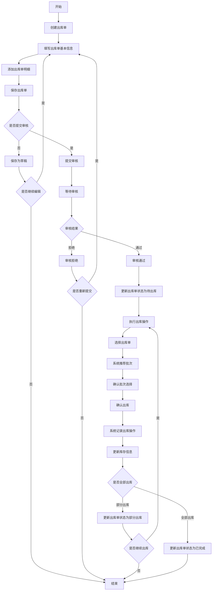
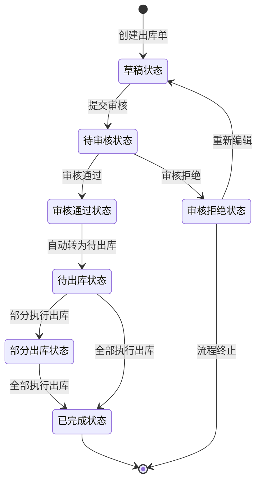

# 📤 WMS 出库管理模块设计文档

## 📋 目录

- [模块概述](#模块概述)
- [功能设计](#功能设计)
- [数据模型](#数据模型)
- [业务流程](#业务流程)
- [状态流转](#状态流转)
- [接口设计](#接口设计)

## 🎯 模块概述

出库管理模块是 WMS 系统的核心功能模块之一，负责管理货物从仓库出库的全过程。通过出库单的创建、审核、执行，确保货物正确出库并更新库存信息，同时记录出库操作的全过程，为后续追溯提供依据。

### 核心功能

- 出库单管理：创建、修改、查询、删除出库单
- 出库审核：提交审核、审核通过、审核拒绝
- 执行出库：根据出库单执行实际出库操作
- 出库记录：记录实际出库的时间、数量、库位等信息

## 🔍 功能设计

### 1. 出库单管理

#### 功能描述

- 创建、修改、查询、删除出库单
- 支持多种出库类型：销售出库、生产出库、调拨出库等
- 设置出库单据的基本信息：单据编号、出库类型、客户、预计出库时间等
- 添加出库单明细：物料、计划数量、批次选择等
- 提交出库单进行审核

#### 业务规则

- 出库单编号系统自动生成，格式：CK + 年月日 + 4 位流水号
- 出库类型包括：销售出库(0)、生产出库(1)、调拨出库(2)、其他出库(3)
- 出库单状态包括：草稿(0)、待审核(1)、审核通过(2)、审核拒绝(3)
- 出库状态包括：待出库(0)、部分出库(1)、已完成(2)
- 出库单创建后默认为草稿状态，可修改
- 出库单提交审核后，状态变为待审核，不可修改
- 出库单审核通过后，状态变为审核通过，可执行出库操作
- 出库单审核拒绝后，状态变为审核拒绝，流程终止

### 2. 批次选择策略

#### 功能描述

- 支持 FIFO 策略（先进先出）：按入库时间先后顺序出库
- 支持 FEFO 策略（先过期先出）：按过期日期先后顺序出库
- 支持手动选择批次：用户手动指定出库批次

#### 业务规则

- FIFO 策略：系统自动按批次创建时间排序，优先选择最早创建的批次
- FEFO 策略：系统自动按批次过期日期排序，优先选择最早过期的批次
- 手动选择：用户可根据实际需求手动选择特定批次出库
- 出库时，系统会检查所选批次的可用库存是否满足出库需求

## 📊 数据模型

### 1. 出库单表(wms_shipment_order)

| 字段名            | 数据类型     | 是否必填 | 描述         |
| ----------------- | ------------ | -------- | ------------ |
| id                | bigint(20)   | 是       | 主键 ID      |
| shipment_order_no | varchar(64)  | 是       | 出库单号     |
| shipment_type     | tinyint(4)   | 是       | 出库类型     |
| customer_id       | bigint(20)   | 否       | 客户 ID      |
| customer_name     | varchar(255) | 否       | 客户名称     |
| warehouse_id      | bigint(20)   | 是       | 仓库 ID      |
| warehouse_name    | varchar(255) | 是       | 仓库名称     |
| area_id           | bigint(20)   | 否       | 货区 ID      |
| area_name         | varchar(255) | 否       | 货区名称     |
| expected_time     | datetime     | 否       | 预计出库时间 |
| status            | tinyint(4)   | 是       | 单据状态     |
| shipment_status   | tinyint(4)   | 是       | 出库状态     |
| auditor           | varchar(64)  | 否       | 审核人       |
| audit_time        | datetime     | 否       | 审核时间     |
| audit_remark      | varchar(512) | 否       | 审核备注     |
| remark            | varchar(512) | 否       | 备注         |
| creator           | varchar(64)  | 是       | 创建人       |
| create_time       | datetime     | 是       | 创建时间     |
| updater           | varchar(64)  | 是       | 更新人       |
| update_time       | datetime     | 是       | 更新时间     |
| deleted           | bit(1)       | 是       | 是否删除     |
| tenant_id         | bigint(20)   | 是       | 租户编号     |

### 2. 出库单明细表(wms_shipment_order_detail)

| 字段名            | 数据类型     | 是否必填 | 描述      |
| ----------------- | ------------ | -------- | --------- |
| id                | bigint(20)   | 是       | 主键 ID   |
| shipment_order_id | bigint(20)   | 是       | 出库单 ID |
| item_id           | bigint(20)   | 是       | 物料 ID   |
| item_code         | varchar(64)  | 是       | 物料编码  |
| item_name         | varchar(255) | 是       | 物料名称  |
| spec              | varchar(255) | 否       | 规格      |
| unit              | varchar(64)  | 否       | 单位      |
| plan_count        | int(11)      | 是       | 计划数量  |
| shipment_count    | int(11)      | 否       | 出库数量  |
| rack_id           | bigint(20)   | 否       | 货架 ID   |
| rack_name         | varchar(255) | 否       | 货架名称  |
| location_id       | bigint(20)   | 否       | 库位 ID   |
| location_name     | varchar(255) | 否       | 库位名称  |
| batch_id          | bigint(20)   | 否       | 批次 ID   |
| status            | tinyint(4)   | 是       | 状态      |
| remark            | varchar(512) | 否       | 备注      |
| creator           | varchar(64)  | 是       | 创建人    |
| create_time       | datetime     | 是       | 创建时间  |
| updater           | varchar(64)  | 是       | 更新人    |
| update_time       | datetime     | 是       | 更新时间  |
| deleted           | bit(1)       | 是       | 是否删除  |
| tenant_id         | bigint(20)   | 是       | 租户编号  |

### 3. 出库操作记录表(wms_shipment_record)

| 字段名                   | 数据类型     | 是否必填 | 描述          |
| ------------------------ | ------------ | -------- | ------------- |
| id                       | bigint(20)   | 是       | 主键 ID       |
| shipment_order_id        | bigint(20)   | 是       | 出库单 ID     |
| shipment_order_no        | varchar(64)  | 是       | 出库单号      |
| shipment_order_detail_id | bigint(20)   | 是       | 出库单明细 ID |
| shipment_type            | tinyint(4)   | 是       | 出库类型      |
| warehouse_id             | bigint(20)   | 是       | 仓库 ID       |
| warehouse_name           | varchar(255) | 是       | 仓库名称      |
| area_id                  | bigint(20)   | 否       | 货区 ID       |
| area_name                | varchar(255) | 否       | 货区名称      |
| rack_id                  | bigint(20)   | 否       | 货架 ID       |
| rack_name                | varchar(255) | 否       | 货架名称      |
| location_id              | bigint(20)   | 否       | 库位 ID       |
| location_name            | varchar(255) | 否       | 库位名称      |
| batch_id                 | bigint(20)   | 否       | 批次 ID       |
| item_id                  | bigint(20)   | 是       | 物料 ID       |
| item_code                | varchar(64)  | 是       | 物料编码      |
| item_name                | varchar(255) | 是       | 物料名称      |
| spec                     | varchar(255) | 否       | 规格          |
| unit                     | varchar(64)  | 否       | 单位          |
| count                    | int(11)      | 是       | 出库数量      |
| customer_id              | bigint(20)   | 否       | 客户 ID       |
| customer_name            | varchar(255) | 否       | 客户名称      |
| shipment_time            | datetime     | 是       | 出库时间      |
| operator                 | varchar(64)  | 是       | 操作人        |
| remark                   | varchar(512) | 否       | 备注          |
| creator                  | varchar(64)  | 是       | 创建人        |
| create_time              | datetime     | 是       | 创建时间      |
| updater                  | varchar(64)  | 是       | 更新人        |
| update_time              | datetime     | 是       | 更新时间      |
| deleted                  | bit(1)       | 是       | 是否删除      |
| tenant_id                | bigint(20)   | 是       | 租户编号      |

## 🔄 业务流程

### 出库管理完整业务流程

## 🔀 状态流转

### 出库单状态流转图

### 出库单状态定义

| 状态码 | 状态名称 | 描述                             |
| ------ | -------- | -------------------------------- |
| 0      | 草稿     | 出库单初始状态，可修改           |
| 1      | 待审核   | 出库单已提交，等待审核，不可修改 |
| 2      | 审核通过 | 出库单已审核通过，可执行出库操作 |
| 3      | 审核拒绝 | 出库单已审核拒绝，流程终止       |

### 出库状态定义

| 状态码 | 状态名称 | 描述                 |
| ------ | -------- | -------------------- |
| 0      | 待出库   | 出库单待执行出库操作 |
| 1      | 部分出库 | 出库单部分商品已出库 |
| 2      | 已完成   | 出库单全部商品已出库 |

## 🔌 接口设计

### 1. 出库单管理接口

#### 获取出库单列表

- **接口路径**: `/wms/shipment-order/page`
- **请求方式**: GET
- **请求参数**: 出库单号、出库类型、单据状态、出库状态、仓库 ID、客户 ID 等
- **响应结果**: 分页返回出库单列表

#### 获取出库单详情

- **接口路径**: `/wms/shipment-order/get`
- **请求方式**: GET
- **请求参数**: 出库单 ID
- **响应结果**: 返回出库单详情及明细列表

#### 创建出库单

- **接口路径**: `/wms/shipment-order/create`
- **请求方式**: POST
- **请求参数**: 出库单基本信息及明细列表
- **响应结果**: 创建成功返回出库单 ID 及单号

#### 更新出库单

- **接口路径**: `/wms/shipment-order/update`
- **请求方式**: PUT
- **请求参数**: 出库单基本信息及明细列表
- **响应结果**: 更新成功返回 true

#### 删除出库单

- **接口路径**: `/wms/shipment-order/delete`
- **请求方式**: DELETE
- **请求参数**: 出库单 ID
- **响应结果**: 删除成功返回 true

#### 提交出库单审核

- **接口路径**: `/wms/shipment-order/submit`
- **请求方式**: POST
- **请求参数**: 出库单 ID
- **响应结果**: 提交成功返回 true

#### 审核出库单

- **接口路径**: `/wms/shipment-order/audit`
- **请求方式**: POST
- **请求参数**: 出库单 ID、审核状态、审核备注
- **响应结果**: 审核成功返回 true

### 2. 出库操作接口

#### 获取推荐批次

- **接口路径**: `/wms/shipment-order/recommend-batch`
- **请求方式**: GET
- **请求参数**: 出库单明细 ID、物料 ID、数量
- **响应结果**: 返回推荐批次列表

#### 执行出库操作

- **接口路径**: `/wms/shipment-record/create`
- **请求方式**: POST
- **请求参数**: 出库单 ID、明细 ID、批次 ID、库位 ID、数量等
- **响应结果**: 出库成功返回 true

#### 获取出库记录列表

- **接口路径**: `/wms/shipment-record/page`
- **请求方式**: GET
- **请求参数**: 出库单 ID、出库单号、出库类型、仓库 ID、物料等
- **响应结果**: 分页返回出库记录列表
