# 📦 WMS基础数据模块设计文档


## 📋 目录

- [模块概述](#模块概述)
- [功能设计](#功能设计)
- [数据模型](#数据模型)
- [业务流程](#业务流程)
- [接口设计](#接口设计)
- [前端界面](#前端界面)

## 🎯 模块概述

基础数据模块是WMS系统的基础组件，负责管理系统中各类主数据，包括客户、供应商、物料、仓库、库位等信息。这些数据为WMS系统的其他功能模块提供基础支持，是保证系统正常运行的关键要素。

### 核心功能

- 客户信息管理：维护客户基本资料
- 供应商信息管理：维护供应商基本资料
- 物料信息管理：维护物料及物料分类信息
- 仓储结构管理：维护仓库、货区、货架、库位等仓储空间结构

## 🔍 功能设计

### 1. 客户管理

#### 功能描述

- 创建、修改、查询、删除客户信息
- 维护客户编码、名称、级别、联系方式等基本属性
- 维护客户的状态（正常/禁用）
- 导入导出客户数据

#### 业务规则

- 客户编码全局唯一，不可重复
- 客户级别分为普通客户(0)、重要客户(1)、VIP客户(2)
- 客户状态包括正常(0)和禁用(1)
- 新建客户默认状态为正常

### 2. 供应商管理

#### 功能描述

- 创建、修改、查询、删除供应商信息
- 维护供应商编码、名称、级别、联系方式等基本属性
- 维护供应商的状态（正常/禁用）
- 导入导出供应商数据

#### 业务规则

- 供应商编码全局唯一，不可重复
- 供应商级别分为普通供应商(0)、重要供应商(1)、战略供应商(2)
- 供应商状态包括正常(0)和禁用(1)
- 新建供应商默认状态为正常

### 3. 物料管理

#### 功能描述

- 创建、修改、查询、删除物料分类
- 创建、修改、查询、删除物料信息
- 维护物料编码、名称、规格、单位、物料类型等属性
- 设置物料的安全库存、物料价格
- 导入导出物料数据

#### 业务规则

- 物料编码全局唯一，不可重复
- 物料必须关联物料分类
- 物料类型包括原材料(0)、半成品(1)、成品(2)、包装材料(3)等
- 物料状态包括正常(0)和禁用(1)
- 可设置物料安全库存，用于库存预警

### 4. 仓库管理

#### 功能描述

- 创建、修改、查询、删除仓库信息
- 创建、修改、查询、删除货区信息
- 创建、修改、查询、删除货架信息
- 创建、修改、查询、删除库位信息
- 维护仓库结构的层级关系
- 设置库位属性和状态

#### 业务规则

- 仓库编码全局唯一，不可重复
- 仓库类型包括原材料仓(0)、成品仓(1)、半成品仓(2)、退货仓(3)等
- 仓库、货区、货架、库位构成4级层级结构
- 库位状态包括空闲(0)、占用(1)、锁定(2)、禁用(3)
- 新建库位默认状态为空闲

## 📊 数据模型

### 1. 客户表(wms_customer)

| 字段名 | 数据类型 | 是否必填 | 描述 |
|-------|---------|---------|------|
| id | bigint(20) | 是 | 主键ID |
| customer_code | varchar(64) | 是 | 客户编码 |
| customer_name | varchar(255) | 是 | 客户名称 |
| customer_level | tinyint(4) | 是 | 客户级别 |
| contact | varchar(64) | 否 | 联系人 |
| phone | varchar(32) | 否 | 联系电话 |
| email | varchar(64) | 否 | 邮箱 |
| address | varchar(255) | 否 | 地址 |
| bank_name | varchar(255) | 否 | 开户银行 |
| bank_account | varchar(255) | 否 | 银行账号 |
| status | tinyint(4) | 是 | 状态 |
| remark | varchar(512) | 否 | 备注 |
| creator | varchar(64) | 是 | 创建人 |
| create_time | datetime | 是 | 创建时间 |
| updater | varchar(64) | 是 | 更新人 |
| update_time | datetime | 是 | 更新时间 |
| deleted | bit(1) | 是 | 是否删除 |
| tenant_id | bigint(20) | 是 | 租户编号 |

### 2. 供应商表(wms_supplier)

| 字段名 | 数据类型 | 是否必填 | 描述 |
|-------|---------|---------|------|
| id | bigint(20) | 是 | 主键ID |
| supplier_code | varchar(64) | 是 | 供应商编码 |
| supplier_name | varchar(255) | 是 | 供应商名称 |
| supplier_level | tinyint(4) | 是 | 供应商级别 |
| contact | varchar(64) | 否 | 联系人 |
| phone | varchar(32) | 否 | 联系电话 |
| email | varchar(64) | 否 | 邮箱 |
| address | varchar(255) | 否 | 地址 |
| bank_name | varchar(255) | 否 | 开户银行 |
| bank_account | varchar(255) | 否 | 银行账号 |
| status | tinyint(4) | 是 | 状态 |
| remark | varchar(512) | 否 | 备注 |
| creator | varchar(64) | 是 | 创建人 |
| create_time | datetime | 是 | 创建时间 |
| updater | varchar(64) | 是 | 更新人 |
| update_time | datetime | 是 | 更新时间 |
| deleted | bit(1) | 是 | 是否删除 |
| tenant_id | bigint(20) | 是 | 租户编号 |

### 3. 物料分类表(wms_item_category)

| 字段名 | 数据类型 | 是否必填 | 描述 |
|-------|---------|---------|------|
| id | bigint(20) | 是 | 主键ID |
| category_code | varchar(64) | 是 | 分类编码 |
| category_name | varchar(255) | 是 | 分类名称 |
| parent_id | bigint(20) | 是 | 父级分类ID |
| status | tinyint(4) | 是 | 状态 |
| sort | int(11) | 是 | 显示顺序 |
| remark | varchar(512) | 否 | 备注 |
| creator | varchar(64) | 是 | 创建人 |
| create_time | datetime | 是 | 创建时间 |
| updater | varchar(64) | 是 | 更新人 |
| update_time | datetime | 是 | 更新时间 |
| deleted | bit(1) | 是 | 是否删除 |
| tenant_id | bigint(20) | 是 | 租户编号 |

### 4. 物料表(wms_item)

| 字段名 | 数据类型 | 是否必填 | 描述 |
|-------|---------|---------|------|
| id | bigint(20) | 是 | 主键ID |
| item_code | varchar(64) | 是 | 物料编码 |
| item_name | varchar(255) | 是 | 物料名称 |
| category_id | bigint(20) | 是 | 分类ID |
| item_type | tinyint(4) | 是 | 物料类型 |
| spec | varchar(255) | 否 | 规格 |
| unit | varchar(64) | 否 | 单位 |
| weight | decimal(10,2) | 否 | 重量 |
| volume | decimal(10,2) | 否 | 体积 |
| bar_code | varchar(64) | 否 | 条码 |
| shelf_life | int(11) | 否 | 保质期(天) |
| safety_stock | int(11) | 否 | 安全库存 |
| status | tinyint(4) | 是 | 状态 |
| remark | varchar(512) | 否 | 备注 |
| creator | varchar(64) | 是 | 创建人 |
| create_time | datetime | 是 | 创建时间 |
| updater | varchar(64) | 是 | 更新人 |
| update_time | datetime | 是 | 更新时间 |
| deleted | bit(1) | 是 | 是否删除 |
| tenant_id | bigint(20) | 是 | 租户编号 |

### 5. 仓库表(wms_warehouse)

| 字段名 | 数据类型 | 是否必填 | 描述 |
|-------|---------|---------|------|
| id | bigint(20) | 是 | 主键ID |
| warehouse_code | varchar(64) | 是 | 仓库编码 |
| warehouse_name | varchar(255) | 是 | 仓库名称 |
| warehouse_type | tinyint(4) | 是 | 仓库类型 |
| address | varchar(255) | 否 | 地址 |
| area | decimal(10,2) | 否 | 面积(平方米) |
| charge_person | varchar(64) | 否 | 负责人 |
| status | tinyint(4) | 是 | 状态 |
| remark | varchar(512) | 否 | 备注 |
| creator | varchar(64) | 是 | 创建人 |
| create_time | datetime | 是 | 创建时间 |
| updater | varchar(64) | 是 | 更新人 |
| update_time | datetime | 是 | 更新时间 |
| deleted | bit(1) | 是 | 是否删除 |
| tenant_id | bigint(20) | 是 | 租户编号 |

### 6. 货区表(wms_area)

| 字段名 | 数据类型 | 是否必填 | 描述 |
|-------|---------|---------|------|
| id | bigint(20) | 是 | 主键ID |
| area_code | varchar(64) | 是 | 货区编码 |
| area_name | varchar(255) | 是 | 货区名称 |
| warehouse_id | bigint(20) | 是 | 所属仓库ID |
| area_type | tinyint(4) | 是 | 货区类型 |
| status | tinyint(4) | 是 | 状态 |
| remark | varchar(512) | 否 | 备注 |
| creator | varchar(64) | 是 | 创建人 |
| create_time | datetime | 是 | 创建时间 |
| updater | varchar(64) | 是 | 更新人 |
| update_time | datetime | 是 | 更新时间 |
| deleted | bit(1) | 是 | 是否删除 |
| tenant_id | bigint(20) | 是 | 租户编号 |

### 7. 货架表(wms_rack)

| 字段名 | 数据类型 | 是否必填 | 描述 |
|-------|---------|---------|------|
| id | bigint(20) | 是 | 主键ID |
| rack_code | varchar(64) | 是 | 货架编码 |
| rack_name | varchar(255) | 是 | 货架名称 |
| area_id | bigint(20) | 是 | 所属货区ID |
| rack_type | tinyint(4) | 是 | 货架类型 |
| status | tinyint(4) | 是 | 状态 |
| remark | varchar(512) | 否 | 备注 |
| creator | varchar(64) | 是 | 创建人 |
| create_time | datetime | 是 | 创建时间 |
| updater | varchar(64) | 是 | 更新人 |
| update_time | datetime | 是 | 更新时间 |
| deleted | bit(1) | 是 | 是否删除 |
| tenant_id | bigint(20) | 是 | 租户编号 |

### 8. 库位表(wms_location)

| 字段名 | 数据类型 | 是否必填 | 描述 |
|-------|---------|---------|------|
| id | bigint(20) | 是 | 主键ID |
| location_code | varchar(64) | 是 | 库位编码 |
| location_name | varchar(255) | 是 | 库位名称 |
| rack_id | bigint(20) | 是 | 所属货架ID |
| location_type | tinyint(4) | 是 | 库位类型 |
| status | tinyint(4) | 是 | 状态 |
| remark | varchar(512) | 否 | 备注 |
| creator | varchar(64) | 是 | 创建人 |
| create_time | datetime | 是 | 创建时间 |
| updater | varchar(64) | 是 | 更新人 |
| update_time | datetime | 是 | 更新时间 |
| deleted | bit(1) | 是 | 是否删除 |
| tenant_id | bigint(20) | 是 | 租户编号 |

## 🔄 业务流程

### 1. 客户管理业务流程

```mermaid
flowchart TD
    A[开始] --> B[登录系统]
    B --> C[进入客户管理模块]
    C --> D{选择操作}
    D -->|新增客户| E[填写客户信息]
    E --> F[保存客户信息]
    F --> G[客户创建成功]
    D -->|修改客户| H[查询客户信息]
    H --> I[修改客户信息]
    I --> J[保存客户信息]
    J --> K[客户更新成功]
    D -->|删除客户| L[查询客户信息]
    L --> M[确认删除]
    M --> N[客户删除成功]
    D -->|查询客户| O[设置查询条件]
    O --> P[显示客户列表]
    G --> Q[结束]
    K --> Q
    N --> Q
    P --> Q
```



### 2. 物料管理业务流程

```mermaid
flowchart TD
    A[开始] --> B[登录系统]
    B --> C[进入物料管理模块]
    C --> D{选择操作}
    D -->|管理物料分类| E[物料分类管理]
    E --> F{分类操作}
    F -->|新增分类| G[填写分类信息]
    G --> H[保存分类信息]
    F -->|修改分类| I[查询分类信息]
    I --> J[修改分类信息]
    J --> K[保存分类信息]
    F -->|删除分类| L[查询分类信息]
    L --> M[确认删除]
    D -->|管理物料| N[物料管理]
    N --> O{物料操作}
    O -->|新增物料| P[填写物料信息]
    P --> Q[选择物料分类]
    Q --> R[保存物料信息]
    O -->|修改物料| S[查询物料信息]
    S --> T[修改物料信息]
    T --> U[保存物料信息]
    O -->|删除物料| V[查询物料信息]
    V --> W[确认删除]
    H --> X[结束]
    K --> X
    M --> X
    R --> X
    U --> X
    W --> X
```



### 3. 仓库层级管理流程

```mermaid
flowchart TD
    A[开始] --> B[登录系统]
    B --> C[进入仓库管理模块]
    C --> D{选择管理层级}
    D -->|仓库管理| E[仓库信息管理]
    E --> F{仓库操作}
    F -->|新增仓库| G[填写仓库信息]
    F -->|修改仓库| H[修改仓库信息]
    F -->|删除仓库| I[删除仓库]
    D -->|货区管理| J[货区信息管理]
    J --> K{货区操作}
    K -->|新增货区| L[选择所属仓库]
    L --> M[填写货区信息]
    K -->|修改货区| N[修改货区信息]
    K -->|删除货区| O[删除货区]
    D -->|货架管理| P[货架信息管理]
    P --> Q{货架操作}
    Q -->|新增货架| R[选择所属货区]
    R --> S[填写货架信息]
    Q -->|修改货架| T[修改货架信息]
    Q -->|删除货架| U[删除货架]
    D -->|库位管理| V[库位信息管理]
    V --> W{库位操作}
    W -->|新增库位| X[选择所属货架]
    X --> Y[填写库位信息]
    W -->|修改库位| Z[修改库位信息]
    W -->|删除库位| AA[删除库位]
    G --> AB[结束]
    H --> AB
    I --> AB
    M --> AB
    N --> AB
    O --> AB
    S --> AB
    T --> AB
    U --> AB
    Y --> AB
    Z --> AB
    AA --> AB
```



## 🔌 接口设计

### 1. 客户管理接口

#### 获取客户列表

- **接口路径**: `/wms/customer/page`
- **请求方式**: GET
- **请求参数**:
  - customerCode: 客户编码（可选）
  - customerName: 客户名称（可选）
  - customerLevel: 客户级别（可选）
  - status: 状态（可选）
  - pageNo: 页码（必填）
  - pageSize: 每页记录数（必填）
- **响应结果**:
  ```json
  {
    "code": 0,
    "data": {
      "list": [
        {
          "id": 1,
          "customerCode": "CUST001",
          "customerName": "示例客户",
          "customerLevel": 1,
          "contact": "张三",
          "phone": "13800138000",
          "email": "zhangsan@example.com",
          "address": "北京市朝阳区",
          "status": 0,
          "createTime": "2023-01-01 12:00:00"
        }
      ],
      "total": 1
    },
    "msg": "操作成功"
  }
  ```

#### 获取客户详情

- **接口路径**: `/wms/customer/get`
- **请求方式**: GET
- **请求参数**:
  - id: 客户ID（必填）
- **响应结果**:
  ```json
  {
    "code": 0,
    "data": {
      "id": 1,
      "customerCode": "CUST001",
      "customerName": "示例客户",
      "customerLevel": 1,
      "contact": "张三",
      "phone": "13800138000",
      "email": "zhangsan@example.com",
      "address": "北京市朝阳区",
      "bankName": "中国银行",
      "bankAccount": "123456789012345678",
      "status": 0,
      "remark": "备注信息",
      "createTime": "2023-01-01 12:00:00",
      "updateTime": "2023-01-02 12:00:00"
    },
    "msg": "操作成功"
  }
  ```

#### 创建客户

- **接口路径**: `/wms/customer/create`
- **请求方式**: POST
- **请求参数**:
  ```json
  {
    "customerCode": "CUST002",
    "customerName": "新客户",
    "customerLevel": 0,
    "contact": "李四",
    "phone": "13900139000",
    "email": "lisi@example.com",
    "address": "上海市浦东新区",
    "bankName": "中国工商银行",
    "bankAccount": "987654321098765432",
    "status": 0,
    "remark": "新增客户"
  }
  ```
- **响应结果**:
  ```json
  {
    "code": 0,
    "data": true,
    "msg": "操作成功"
  }
  ```

#### 更新客户

- **接口路径**: `/wms/customer/update`
- **请求方式**: PUT
- **请求参数**:
  ```json
  {
    "id": 1,
    "customerCode": "CUST001",
    "customerName": "修改后的客户名称",
    "customerLevel": 2,
    "contact": "张三",
    "phone": "13800138000",
    "email": "zhangsan@example.com",
    "address": "北京市朝阳区",
    "bankName": "中国银行",
    "bankAccount": "123456789012345678",
    "status": 0,
    "remark": "更新备注"
  }
  ```
- **响应结果**:
  ```json
  {
    "code": 0,
    "data": true,
    "msg": "操作成功"
  }
  ```

#### 删除客户

- **接口路径**: `/wms/customer/delete`
- **请求方式**: DELETE
- **请求参数**:
  - id: 客户ID（必填）
- **响应结果**:
  ```json
  {
    "code": 0,
    "data": true,
    "msg": "操作成功"
  }
  ```

### 2. 物料管理接口

类似客户管理接口，此处省略详细接口定义...

### 3. 仓库管理接口

类似客户管理接口，此处省略详细接口定义...

## 💻 前端界面

### 1. 客户管理界面

#### 客户列表页


- **功能说明**:
  - 顶部搜索区：提供客户编码、名称、级别、状态等搜索条件
  - 操作按钮区：新增、导出等操作按钮
  - 数据表格区：显示客户列表数据，包括编码、名称、级别、联系人等字段
  - 表格操作列：编辑、删除等操作按钮
  - 分页控件：控制分页显示

#### 客户编辑页


- **功能说明**:
  - 表单区：包含客户编码、名称、级别、联系方式等输入字段
  - 按钮区：保存、取消等操作按钮
  - 验证规则：客户编码、名称等必填项验证

### 2. 物料管理界面

#### 物料分类管理页


- **功能说明**:
  - 左侧树形结构：显示物料分类层级关系
  - 右侧详情区：显示和编辑选中分类的详细信息
  - 操作按钮：添加子分类、编辑、删除等操作

#### 物料列表页


- **功能说明**:
  - 顶部搜索区：提供物料编码、名称、分类、类型等搜索条件
  - 操作按钮区：新增、导出等操作按钮
  - 数据表格区：显示物料列表数据，包括编码、名称、分类、规格等字段
  - 表格操作列：编辑、删除等操作按钮
  - 分页控件：控制分页显示

### 3. 仓库管理界面

#### 仓库结构管理页


- **功能说明**:
  - 顶部操作区：切换不同层级（仓库/货区/货架/库位）的标签页
  - 数据展示区：以表格或树形结构展示仓库层级关系
  - 层级选择区：级联选择仓库、货区、货架等 