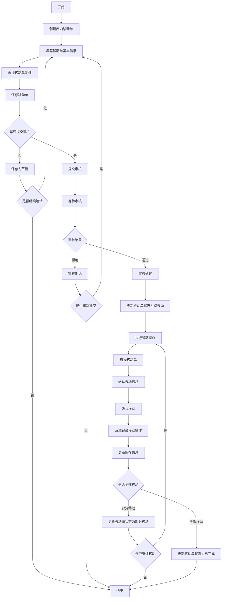
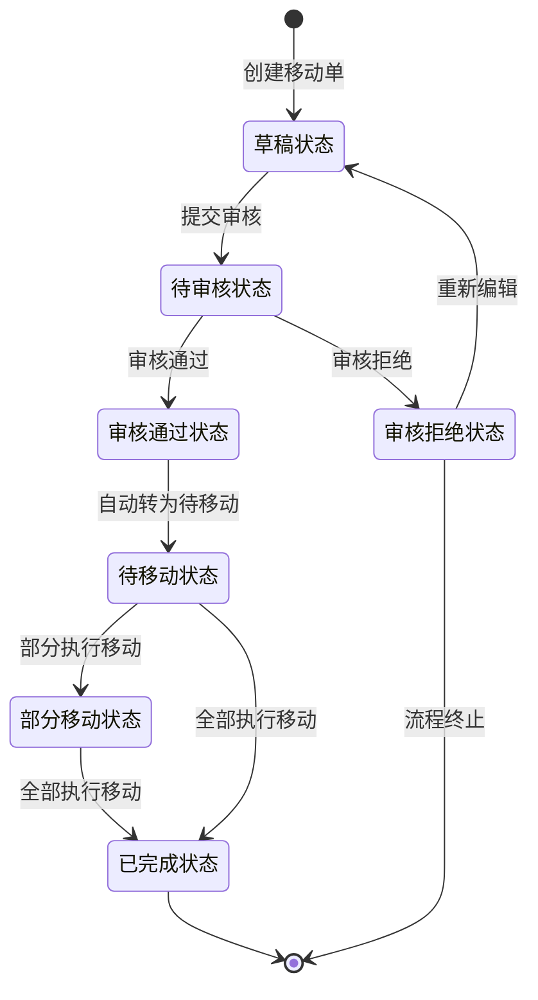

# 🔄 WMS库内移动模块设计文档


## 📋 目录

- [模块概述](#模块概述)
- [功能设计](#功能设计)
- [数据模型](#数据模型)
- [业务流程](#业务流程)
- [状态流转](#状态流转)
- [接口设计](#接口设计)
- [前端界面](#前端界面)

## 🎯 模块概述

库内移动模块是WMS系统的重要功能模块，负责管理仓库内部的物料移动操作。通过库内移动单的创建、审核、执行，实现物料在仓库内不同库位之间的转移，优化仓库空间利用，提高库存管理效率，同时保证库存数据准确性。

### 核心功能

- 库内移动单管理：创建、修改、查询、删除库内移动单
- 移动审核：提交审核、审核通过、审核拒绝
- 执行移动：根据移动单执行实际移动操作
- 移动记录：记录实际移动的时间、数量、源库位、目标库位等信息

## 🔍 功能设计

### 1. 库内移动单管理

#### 功能描述

- 创建、修改、查询、删除库内移动单
- 支持多种移动类型：库位调整、质量状态调整、批次调整等
- 设置移动单据的基本信息：单据编号、移动类型、移动原因等
- 添加移动单明细：物料、移动数量、源库位、目标库位等
- 提交移动单进行审核

#### 业务规则

- 移动单编号系统自动生成，格式：YD + 年月日 + 4位流水号
- 移动类型包括：库位调整(0)、质量状态调整(1)、批次调整(2)、其他调整(3)
- 移动单状态包括：草稿(0)、待审核(1)、审核通过(2)、审核拒绝(3)
- 移动状态包括：待移动(0)、部分移动(1)、已完成(2)
- 移动单创建后默认为草稿状态，可修改
- 移动单提交审核后，状态变为待审核，不可修改
- 移动单审核通过后，状态变为审核通过，可执行移动操作
- 移动单审核拒绝后，状态变为审核拒绝，流程终止

### 2. 库内移动单审核

#### 功能描述

- 查看待审核的移动单
- 审核移动单：审核通过或审核拒绝
- 审核通过后，系统自动将移动单状态设为待移动
- 审核拒绝需填写拒绝原因

#### 业务规则

- 只有状态为待审核的移动单可以审核
- 审核通过的移动单将进入待移动状态，可执行移动操作
- 审核拒绝的移动单流程终止，不可执行移动操作
- 具有移动审核权限的用户才能进行审核操作

### 3. 执行库内移动

#### 功能描述

- 查看待移动的移动单
- 根据移动单执行实际移动操作
- 录入实际移动数量、确认源库位和目标库位
- 支持部分移动和全部移动
- 记录移动操作历史

#### 业务规则

- 只有状态为审核通过的移动单可以执行移动操作
- 移动数量不能超过计划数量
- 移动时必须确认源库位和目标库位
- 源库位必须有足够的可用库存
- 部分移动后，移动状态变为部分移动
- 全部移动后，移动状态变为已完成
- 移动完成后，系统自动更新库存信息
- 移动完成后，系统自动记录库存移动记录

## 📊 数据模型

### 1. 库内移动单表(wms_move_order)

| 字段名 | 数据类型 | 是否必填 | 描述 |
|-------|---------|---------|------|
| id | bigint(20) | 是 | 主键ID |
| move_order_no | varchar(64) | 是 | 移动单号 |
| move_type | tinyint(4) | 是 | 移动类型 |
| warehouse_id | bigint(20) | 是 | 仓库ID |
| warehouse_name | varchar(255) | 是 | 仓库名称 |
| status | tinyint(4) | 是 | 单据状态 |
| move_status | tinyint(4) | 是 | 移动状态 |
| plan_time | datetime | 否 | 计划移动时间 |
| reason | varchar(255) | 否 | 移动原因 |
| auditor | varchar(64) | 否 | 审核人 |
| audit_time | datetime | 否 | 审核时间 |
| audit_remark | varchar(512) | 否 | 审核备注 |
| remark | varchar(512) | 否 | 备注 |
| creator | varchar(64) | 是 | 创建人 |
| create_time | datetime | 是 | 创建时间 |
| updater | varchar(64) | 是 | 更新人 |
| update_time | datetime | 是 | 更新时间 |
| deleted | bit(1) | 是 | 是否删除 |
| tenant_id | bigint(20) | 是 | 租户编号 |

### 2. 库内移动单明细表(wms_move_order_detail)

| 字段名 | 数据类型 | 是否必填 | 描述 |
|-------|---------|---------|------|
| id | bigint(20) | 是 | 主键ID |
| move_order_id | bigint(20) | 是 | 移动单ID |
| item_id | bigint(20) | 是 | 物料ID |
| item_code | varchar(64) | 是 | 物料编码 |
| item_name | varchar(255) | 是 | 物料名称 |
| spec | varchar(255) | 否 | 规格 |
| unit | varchar(64) | 否 | 单位 |
| plan_count | int(11) | 是 | 计划数量 |
| move_count | int(11) | 否 | 已移动数量 |
| source_area_id | bigint(20) | 否 | 源货区ID |
| source_area_name | varchar(255) | 否 | 源货区名称 |
| source_rack_id | bigint(20) | 否 | 源货架ID |
| source_rack_name | varchar(255) | 否 | 源货架名称 |
| source_location_id | bigint(20) | 是 | 源库位ID |
| source_location_name | varchar(255) | 是 | 源库位名称 |
| target_area_id | bigint(20) | 否 | 目标货区ID |
| target_area_name | varchar(255) | 否 | 目标货区名称 |
| target_rack_id | bigint(20) | 否 | 目标货架ID |
| target_rack_name | varchar(255) | 否 | 目标货架名称 |
| target_location_id | bigint(20) | 是 | 目标库位ID |
| target_location_name | varchar(255) | 是 | 目标库位名称 |
| batch_id | bigint(20) | 否 | 批次ID |
| batch_code | varchar(64) | 否 | 批次号 |
| status | tinyint(4) | 是 | 状态 |
| remark | varchar(512) | 否 | 备注 |
| creator | varchar(64) | 是 | 创建人 |
| create_time | datetime | 是 | 创建时间 |
| updater | varchar(64) | 是 | 更新人 |
| update_time | datetime | 是 | 更新时间 |
| deleted | bit(1) | 是 | 是否删除 |
| tenant_id | bigint(20) | 是 | 租户编号 |

### 3. 库内移动记录表(wms_move_record)

| 字段名 | 数据类型 | 是否必填 | 描述 |
|-------|---------|---------|------|
| id | bigint(20) | 是 | 主键ID |
| move_order_id | bigint(20) | 是 | 移动单ID |
| move_order_no | varchar(64) | 是 | 移动单号 |
| move_order_detail_id | bigint(20) | 是 | 移动单明细ID |
| move_type | tinyint(4) | 是 | 移动类型 |
| warehouse_id | bigint(20) | 是 | 仓库ID |
| warehouse_name | varchar(255) | 是 | 仓库名称 |
| item_id | bigint(20) | 是 | 物料ID |
| item_code | varchar(64) | 是 | 物料编码 |
| item_name | varchar(255) | 是 | 物料名称 |
| spec | varchar(255) | 否 | 规格 |
| unit | varchar(64) | 否 | 单位 |
| count | int(11) | 是 | 移动数量 |
| source_area_id | bigint(20) | 否 | 源货区ID |
| source_area_name | varchar(255) | 否 | 源货区名称 |
| source_rack_id | bigint(20) | 否 | 源货架ID |
| source_rack_name | varchar(255) | 否 | 源货架名称 |
| source_location_id | bigint(20) | 是 | 源库位ID |
| source_location_name | varchar(255) | 是 | 源库位名称 |
| target_area_id | bigint(20) | 否 | 目标货区ID |
| target_area_name | varchar(255) | 否 | 目标货区名称 |
| target_rack_id | bigint(20) | 否 | 目标货架ID |
| target_rack_name | varchar(255) | 否 | 目标货架名称 |
| target_location_id | bigint(20) | 是 | 目标库位ID |
| target_location_name | varchar(255) | 是 | 目标库位名称 |
| batch_id | bigint(20) | 否 | 批次ID |
| batch_code | varchar(64) | 否 | 批次号 |
| move_time | datetime | 是 | 移动时间 |
| operator | varchar(64) | 是 | 操作人 |
| remark | varchar(512) | 否 | 备注 |
| creator | varchar(64) | 是 | 创建人 |
| create_time | datetime | 是 | 创建时间 |
| updater | varchar(64) | 是 | 更新人 |
| update_time | datetime | 是 | 更新时间 |
| deleted | bit(1) | 是 | 是否删除 |
| tenant_id | bigint(20) | 是 | 租户编号 |

## 🔄 业务流程

### 库内移动完整业务流程



## 🔀 状态流转

### 库内移动单状态流转图



### 库内移动单状态定义

| 状态码 | 状态名称 | 描述 |
|-------|---------|------|
| 0 | 草稿 | 移动单初始状态，可修改 |
| 1 | 待审核 | 移动单已提交，等待审核，不可修改 |
| 2 | 审核通过 | 移动单已审核通过，可执行移动操作 |
| 3 | 审核拒绝 | 移动单已审核拒绝，流程终止 |

### 移动状态定义

| 状态码 | 状态名称 | 描述 |
|-------|---------|------|
| 0 | 待移动 | 移动单待执行移动操作 |
| 1 | 部分移动 | 移动单部分商品已移动 |
| 2 | 已完成 | 移动单全部商品已移动 |

## 🔌 接口设计

### 1. 库内移动单管理接口

#### 获取移动单列表

- **接口路径**: `/wms/move-order/page`
- **请求方式**: GET
- **请求参数**:
  - moveOrderNo: 移动单号（可选）
  - moveType: 移动类型（可选）
  - status: 单据状态（可选）
  - moveStatus: 移动状态（可选）
  - warehouseId: 仓库ID（可选）
  - createTime: 创建时间范围（可选）
  - pageNo: 页码（必填）
  - pageSize: 每页记录数（必填）
- **响应结果**: 分页返回移动单列表

#### 获取移动单详情

- **接口路径**: `/wms/move-order/get`
- **请求方式**: GET
- **请求参数**:
  - id: 移动单ID（必填）
- **响应结果**: 返回移动单详情及明细列表

#### 创建移动单

- **接口路径**: `/wms/move-order/create`
- **请求方式**: POST
- **请求参数**:
  ```json
  {
    "moveType": 0,
    "warehouseId": 1,
    "warehouseName": "主仓库",
    "planTime": "2023-01-02 12:00:00",
    "reason": "库位优化",
    "remark": "库位调整",
    "details": [
      {
        "itemId": 1,
        "itemCode": "ITEM001",
        "itemName": "示例物料",
        "spec": "规格",
        "unit": "个",
        "planCount": 50,
        "sourceLocationId": 1,
        "sourceLocationName": "A01",
        "targetLocationId": 2,
        "targetLocationName": "B01",
        "batchId": 1,
        "batchCode": "BT20230101"
      }
    ]
  }
  ```
- **响应结果**: 创建成功返回移动单ID及单号

#### 更新移动单

- **接口路径**: `/wms/move-order/update`
- **请求方式**: PUT
- **请求参数**: 与创建移动单类似，增加id字段
- **响应结果**: 更新成功返回true

#### 删除移动单

- **接口路径**: `/wms/move-order/delete`
- **请求方式**: DELETE
- **请求参数**:
  - id: 移动单ID（必填）
- **响应结果**: 删除成功返回true

#### 提交移动单审核

- **接口路径**: `/wms/move-order/submit`
- **请求方式**: POST
- **请求参数**:
  - id: 移动单ID（必填）
- **响应结果**: 提交成功返回true

#### 审核移动单

- **接口路径**: `/wms/move-order/audit`
- **请求方式**: POST
- **请求参数**:
  ```json
  {
    "id": 1,
    "auditStatus": 2,
    "auditRemark": "审核通过"
  }
  ```
- **响应结果**: 审核成功返回true

### 2. 库内移动操作接口

#### 执行移动操作

- **接口路径**: `/wms/move-record/create`
- **请求方式**: POST
- **请求参数**:
  ```json
  {
    "moveOrderId": 1,
    "moveOrderDetailId": 1,
    "count": 20,
    "remark": "部分移动"
  }
  ```
- **响应结果**: 移动成功返回true

#### 获取移动记录列表

- **接口路径**: `/wms/move-record/page`
- **请求方式**: GET
- **请求参数**:
  - moveOrderId: 移动单ID（可选）
  - moveOrderNo: 移动单号（可选）
  - moveType: 移动类型（可选）
  - warehouseId: 仓库ID（可选）
  - itemCode: 物料编码（可选）
  - moveTime: 移动时间范围（可选）
  - pageNo: 页码（必填）
  - pageSize: 每页记录数（必填）
- **响应结果**: 分页返回移动记录列表

## 💻 前端界面

### 1. 库内移动单列表页

- **功能说明**:
  - 顶部搜索区：提供移动单号、移动类型、单据状态、移动状态、仓库等搜索条件
  - 操作按钮区：新增、导出等操作按钮
  - 数据表格区：显示移动单列表数据，包括单号、类型、状态、仓库等字段
  - 表格操作列：编辑、删除、提交审核、查看详情等操作按钮
  - 分页控件：控制分页显示

### 2. 库内移动单编辑页

- **功能说明**:
  - 基本信息区：包含移动单号、移动类型、仓库、计划移动时间、移动原因等字段
  - 明细信息区：物料列表，包含物料编码、名称、规格、单位、计划数量、源库位、目标库位等字段
  - 明细操作按钮：添加、删除明细项
  - 表单操作按钮：保存、取消、提交审核等操作按钮

### 3. 库内移动单详情页

- **功能说明**:
  - 基本信息区：显示移动单基本信息，包括单号、类型、状态、仓库等
  - 审核信息区：显示审核人、审核时间、审核备注等信息
  - 明细信息区：显示移动单明细，包括物料、计划数量、已移动数量、源库位、目标库位等
  - 移动记录区：显示该移动单相关的移动操作记录
  - 操作按钮：根据移动单状态显示不同的操作按钮，如提交审核、执行移动等

### 4. 执行移动页面

- **功能说明**:
  - 移动单信息区：显示移动单基本信息
  - 待移动明细区：显示待移动的物料明细
  - 移动操作区：确认源库位、目标库位、输入移动数量等
  - 操作按钮：确认移动、取消等操作按钮 