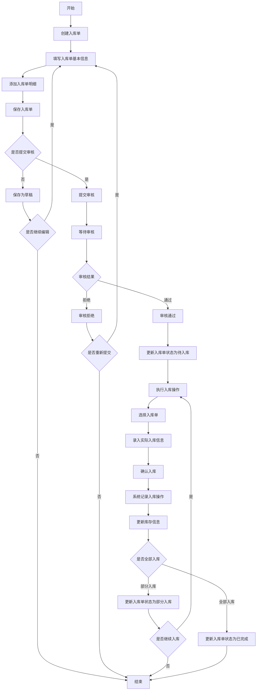
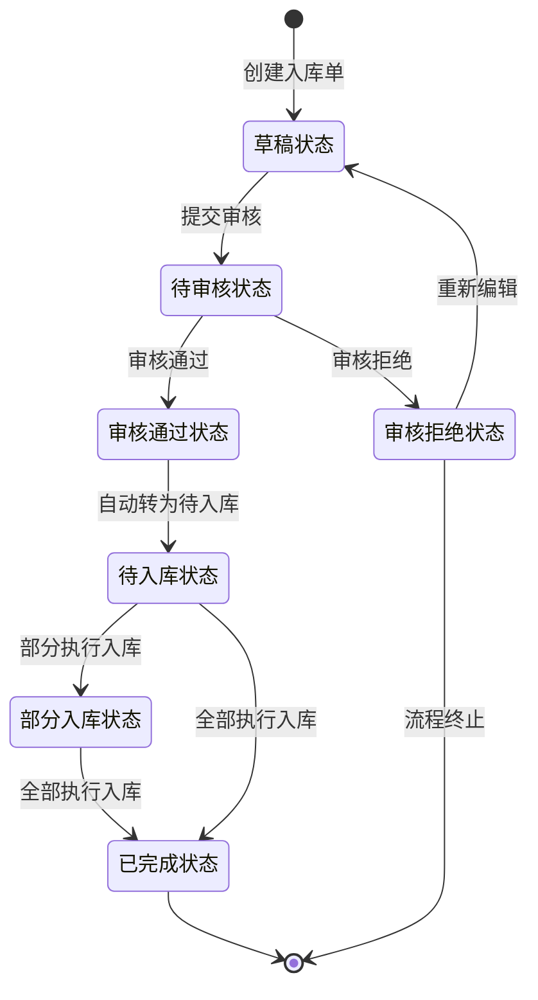

# 📥 WMS入库管理模块设计文档


## 📋 目录

- [模块概述](#模块概述)
- [功能设计](#功能设计)
- [数据模型](#数据模型)
- [业务流程](#业务流程)
- [状态流转](#状态流转)
- [接口设计](#接口设计)
- [前端界面](#前端界面)

## 🎯 模块概述

入库管理模块是WMS系统的核心功能模块之一，负责管理货物从外部进入仓库的全过程。通过入库单的创建、审核、执行，确保货物正确入库并更新库存信息，同时记录入库操作的全过程，为后续追溯提供依据。

### 核心功能

- 入库单管理：创建、修改、查询、删除入库单
- 入库审核：提交审核、审核通过、审核拒绝
- 执行入库：根据入库单执行实际入库操作
- 入库记录：记录实际入库的时间、数量、库位等信息

## 🔍 功能设计

### 1. 入库单管理

#### 功能描述

- 创建、修改、查询、删除入库单
- 支持多种入库类型：采购入库、生产入库、退货入库、调拨入库等
- 设置入库单据的基本信息：单据编号、入库类型、供应商、预计入库时间等
- 添加入库单明细：物料、计划数量、批次信息等
- 提交入库单进行审核

#### 业务规则

- 入库单编号系统自动生成，格式：RK + 年月日 + 4位流水号
- 入库类型包括：采购入库(0)、生产入库(1)、退货入库(2)、调拨入库(3)、其他入库(4)
- 入库单状态包括：草稿(0)、待审核(1)、审核通过(2)、审核拒绝(3)
- 入库状态包括：待入库(0)、部分入库(1)、已完成(2)
- 入库单创建后默认为草稿状态，可修改
- 入库单提交审核后，状态变为待审核，不可修改
- 入库单审核通过后，状态变为审核通过，可执行入库操作
- 入库单审核拒绝后，状态变为审核拒绝，流程终止

### 2. 入库单审核

#### 功能描述

- 查看待审核的入库单
- 审核入库单：审核通过或审核拒绝
- 审核通过后，系统自动将入库单状态设为待入库
- 审核拒绝需填写拒绝原因

#### 业务规则

- 只有状态为待审核的入库单可以审核
- 审核通过的入库单将进入待入库状态，可执行入库操作
- 审核拒绝的入库单流程终止，不可执行入库操作
- 具有入库审核权限的用户才能进行审核操作

### 3. 执行入库

#### 功能描述

- 查看待入库的入库单
- 根据入库单执行实际入库操作
- 录入实际入库数量、入库库位、批次信息等
- 支持部分入库和全部入库
- 记录入库操作历史

#### 业务规则

- 只有状态为审核通过的入库单可以执行入库操作
- 入库数量不能超过计划数量
- 入库时必须选择库位
- 入库时需录入或选择批次信息
- 部分入库后，入库状态变为部分入库
- 全部入库后，入库状态变为已完成
- 入库完成后，系统自动更新库存信息
- 入库完成后，系统自动记录库存移动记录
- 入库完成后，系统自动记录批次操作记录（如果启用批次管理）

## 📊 数据模型

### 1. 入库单表(wms_receipt_order)

| 字段名 | 数据类型 | 是否必填 | 描述 |
|-------|---------|---------|------|
| id | bigint(20) | 是 | 主键ID |
| receipt_order_no | varchar(64) | 是 | 入库单号 |
| receipt_type | tinyint(4) | 是 | 入库类型 |
| supplier_id | bigint(20) | 否 | 供应商ID |
| supplier_name | varchar(255) | 否 | 供应商名称 |
| warehouse_id | bigint(20) | 是 | 仓库ID |
| warehouse_name | varchar(255) | 是 | 仓库名称 |
| area_id | bigint(20) | 否 | 货区ID |
| area_name | varchar(255) | 否 | 货区名称 |
| expected_time | datetime | 否 | 预计到货时间 |
| status | tinyint(4) | 是 | 单据状态 |
| receipt_status | tinyint(4) | 是 | 入库状态 |
| auditor | varchar(64) | 否 | 审核人 |
| audit_time | datetime | 否 | 审核时间 |
| audit_remark | varchar(512) | 否 | 审核备注 |
| remark | varchar(512) | 否 | 备注 |
| creator | varchar(64) | 是 | 创建人 |
| create_time | datetime | 是 | 创建时间 |
| updater | varchar(64) | 是 | 更新人 |
| update_time | datetime | 是 | 更新时间 |
| deleted | bit(1) | 是 | 是否删除 |
| tenant_id | bigint(20) | 是 | 租户编号 |

### 2. 入库单明细表(wms_receipt_order_detail)

| 字段名 | 数据类型 | 是否必填 | 描述 |
|-------|---------|---------|------|
| id | bigint(20) | 是 | 主键ID |
| receipt_order_id | bigint(20) | 是 | 入库单ID |
| item_id | bigint(20) | 是 | 物料ID |
| item_code | varchar(64) | 是 | 物料编码 |
| item_name | varchar(255) | 是 | 物料名称 |
| spec | varchar(255) | 否 | 规格 |
| unit | varchar(64) | 否 | 单位 |
| plan_count | int(11) | 是 | 计划数量 |
| receipt_count | int(11) | 否 | 入库数量 |
| rack_id | bigint(20) | 否 | 货架ID |
| rack_name | varchar(255) | 否 | 货架名称 |
| location_id | bigint(20) | 否 | 库位ID |
| location_name | varchar(255) | 否 | 库位名称 |
| batch_id | bigint(20) | 否 | 批次ID |
| status | tinyint(4) | 是 | 状态 |
| remark | varchar(512) | 否 | 备注 |
| creator | varchar(64) | 是 | 创建人 |
| create_time | datetime | 是 | 创建时间 |
| updater | varchar(64) | 是 | 更新人 |
| update_time | datetime | 是 | 更新时间 |
| deleted | bit(1) | 是 | 是否删除 |
| tenant_id | bigint(20) | 是 | 租户编号 |

### 3. 入库操作记录表(wms_receipt_record)

| 字段名 | 数据类型 | 是否必填 | 描述 |
|-------|---------|---------|------|
| id | bigint(20) | 是 | 主键ID |
| receipt_order_id | bigint(20) | 是 | 入库单ID |
| receipt_order_no | varchar(64) | 是 | 入库单号 |
| receipt_order_detail_id | bigint(20) | 是 | 入库单明细ID |
| receipt_type | tinyint(4) | 是 | 入库类型 |
| warehouse_id | bigint(20) | 是 | 仓库ID |
| warehouse_name | varchar(255) | 是 | 仓库名称 |
| area_id | bigint(20) | 否 | 货区ID |
| area_name | varchar(255) | 否 | 货区名称 |
| rack_id | bigint(20) | 否 | 货架ID |
| rack_name | varchar(255) | 否 | 货架名称 |
| location_id | bigint(20) | 否 | 库位ID |
| location_name | varchar(255) | 否 | 库位名称 |
| batch_id | bigint(20) | 否 | 批次ID |
| item_id | bigint(20) | 是 | 物料ID |
| item_code | varchar(64) | 是 | 物料编码 |
| item_name | varchar(255) | 是 | 物料名称 |
| spec | varchar(255) | 否 | 规格 |
| unit | varchar(64) | 否 | 单位 |
| count | int(11) | 是 | 入库数量 |
| supplier_id | bigint(20) | 否 | 供应商ID |
| supplier_name | varchar(255) | 否 | 供应商名称 |
| receipt_time | datetime | 是 | 入库时间 |
| operator | varchar(64) | 是 | 操作人 |
| remark | varchar(512) | 否 | 备注 |
| creator | varchar(64) | 是 | 创建人 |
| create_time | datetime | 是 | 创建时间 |
| updater | varchar(64) | 是 | 更新人 |
| update_time | datetime | 是 | 更新时间 |
| deleted | bit(1) | 是 | 是否删除 |
| tenant_id | bigint(20) | 是 | 租户编号 |

## 🔄 业务流程

### 入库管理完整业务流程



## 🔀 状态流转

### 入库单状态流转图



### 入库单状态定义

| 状态码 | 状态名称 | 描述 |
|-------|---------|------|
| 0 | 草稿 | 入库单初始状态，可修改 |
| 1 | 待审核 | 入库单已提交，等待审核，不可修改 |
| 2 | 审核通过 | 入库单已审核通过，可执行入库操作 |
| 3 | 审核拒绝 | 入库单已审核拒绝，流程终止 |

### 入库状态定义

| 状态码 | 状态名称 | 描述 |
|-------|---------|------|
| 0 | 待入库 | 入库单待执行入库操作 |
| 1 | 部分入库 | 入库单部分商品已入库 |
| 2 | 已完成 | 入库单全部商品已入库 |

## 🔌 接口设计

### 1. 入库单管理接口

#### 获取入库单列表

- **接口路径**: `/wms/receipt-order/page`
- **请求方式**: GET
- **请求参数**:
  - receiptOrderNo: 入库单号（可选）
  - receiptType: 入库类型（可选）
  - status: 单据状态（可选）
  - receiptStatus: 入库状态（可选）
  - warehouseId: 仓库ID（可选）
  - supplierId: 供应商ID（可选）
  - createTime: 创建时间范围（可选）
  - pageNo: 页码（必填）
  - pageSize: 每页记录数（必填）
- **响应结果**:
  ```json
  {
    "code": 0,
    "data": {
      "list": [
        {
          "id": 1,
          "receiptOrderNo": "RK202301010001",
          "receiptType": 0,
          "supplierName": "示例供应商",
          "warehouseName": "主仓库",
          "status": 2,
          "receiptStatus": 1,
          "expectedTime": "2023-01-02 12:00:00",
          "createTime": "2023-01-01 12:00:00"
        }
      ],
      "total": 1
    },
    "msg": "操作成功"
  }
  ```

#### 获取入库单详情

- **接口路径**: `/wms/receipt-order/get`
- **请求方式**: GET
- **请求参数**:
  - id: 入库单ID（必填）
- **响应结果**:
  ```json
  {
    "code": 0,
    "data": {
      "id": 1,
      "receiptOrderNo": "RK202301010001",
      "receiptType": 0,
      "supplierId": 1,
      "supplierName": "示例供应商",
      "warehouseId": 1,
      "warehouseName": "主仓库",
      "areaId": 1,
      "areaName": "A区",
      "expectedTime": "2023-01-02 12:00:00",
      "status": 2,
      "receiptStatus": 1,
      "auditor": "admin",
      "auditTime": "2023-01-01 14:00:00",
      "auditRemark": "审核通过",
      "remark": "采购入库",
      "details": [
        {
          "id": 1,
          "receiptOrderId": 1,
          "itemId": 1,
          "itemCode": "ITEM001",
          "itemName": "示例物料",
          "spec": "规格",
          "unit": "个",
          "planCount": 100,
          "receiptCount": 50,
          "rackId": 1,
          "rackName": "A货架",
          "locationId": 1,
          "locationName": "A01",
          "batchId": 1,
          "status": 1
        }
      ],
      "createTime": "2023-01-01 12:00:00",
      "updateTime": "2023-01-01 14:30:00"
    },
    "msg": "操作成功"
  }
  ```

#### 创建入库单

- **接口路径**: `/wms/receipt-order/create`
- **请求方式**: POST
- **请求参数**:
  ```json
  {
    "receiptType": 0,
    "supplierId": 1,
    "supplierName": "示例供应商",
    "warehouseId": 1,
    "warehouseName": "主仓库",
    "areaId": 1,
    "areaName": "A区",
    "expectedTime": "2023-01-02 12:00:00",
    "remark": "采购入库",
    "details": [
      {
        "itemId": 1,
        "itemCode": "ITEM001",
        "itemName": "示例物料",
        "spec": "规格",
        "unit": "个",
        "planCount": 100
      }
    ]
  }
  ```
- **响应结果**:
  ```json
  {
    "code": 0,
    "data": {
      "id": 1,
      "receiptOrderNo": "RK202301010001"
    },
    "msg": "操作成功"
  }
  ```

#### 更新入库单

- **接口路径**: `/wms/receipt-order/update`
- **请求方式**: PUT
- **请求参数**:
  ```json
  {
    "id": 1,
    "receiptType": 0,
    "supplierId": 1,
    "supplierName": "示例供应商",
    "warehouseId": 1,
    "warehouseName": "主仓库",
    "areaId": 1,
    "areaName": "A区",
    "expectedTime": "2023-01-03 12:00:00",
    "remark": "采购入库-修改",
    "details": [
      {
        "id": 1,
        "receiptOrderId": 1,
        "itemId": 1,
        "itemCode": "ITEM001",
        "itemName": "示例物料",
        "spec": "规格",
        "unit": "个",
        "planCount": 150
      }
    ]
  }
  ```
- **响应结果**:
  ```json
  {
    "code": 0,
    "data": true,
    "msg": "操作成功"
  }
  ```

#### 删除入库单

- **接口路径**: `/wms/receipt-order/delete`
- **请求方式**: DELETE
- **请求参数**:
  - id: 入库单ID（必填）
- **响应结果**:
  ```json
  {
    "code": 0,
    "data": true,
    "msg": "操作成功"
  }
  ```

#### 提交入库单审核

- **接口路径**: `/wms/receipt-order/submit`
- **请求方式**: POST
- **请求参数**:
  - id: 入库单ID（必填）
- **响应结果**:
  ```json
  {
    "code": 0,
    "data": true,
    "msg": "操作成功"
  }
  ```

#### 审核入库单

- **接口路径**: `/wms/receipt-order/audit`
- **请求方式**: POST
- **请求参数**:
  ```json
  {
    "id": 1,
    "auditStatus": 2,
    "auditRemark": "审核通过"
  }
  ```
- **响应结果**:
  ```json
  {
    "code": 0,
    "data": true,
    "msg": "操作成功"
  }
  ```

### 2. 入库操作接口

#### 执行入库操作

- **接口路径**: `/wms/receipt-record/create`
- **请求方式**: POST
- **请求参数**:
  ```json
  {
    "receiptOrderId": 1,
    "receiptOrderDetailId": 1,
    "count": 50,
    "rackId": 1,
    "rackName": "A货架",
    "locationId": 1,
    "locationName": "A01",
    "batchId": 1,
    "remark": "部分入库"
  }
  ```
- **响应结果**:
  ```json
  {
    "code": 0,
    "data": true,
    "msg": "操作成功"
  }
  ```

#### 获取入库记录列表

- **接口路径**: `/wms/receipt-record/page`
- **请求方式**: GET
- **请求参数**:
  - receiptOrderId: 入库单ID（可选）
  - receiptOrderNo: 入库单号（可选）
  - receiptType: 入库类型（可选）
  - warehouseId: 仓库ID（可选）
  - itemCode: 物料编码（可选）
  - itemName: 物料名称（可选）
  - receiptTime: 入库时间范围（可选）
  - pageNo: 页码（必填）
  - pageSize: 每页记录数（必填）
- **响应结果**:
  ```json
  {
    "code": 0,
    "data": {
      "list": [
        {
          "id": 1,
          "receiptOrderId": 1,
          "receiptOrderNo": "RK202301010001",
          "receiptType": 0,
          "warehouseName": "主仓库",
          "locationName": "A01",
          "itemCode": "ITEM001",
          "itemName": "示例物料",
          "count": 50,
          "receiptTime": "2023-01-01 14:30:00",
          "operator": "admin"
        }
      ],
      "total": 1
    },
    "msg": "操作成功"
  }
  ```

## 💻 前端界面

### 1. 入库单列表页


- **功能说明**:
  - 顶部搜索区：提供入库单号、入库类型、单据状态、入库状态、仓库、供应商等搜索条件
  - 操作按钮区：新增、导出等操作按钮
  - 数据表格区：显示入库单列表数据，包括单号、类型、状态、供应商、仓库等字段
  - 表格操作列：编辑、删除、提交审核、查看详情等操作按钮
  - 分页控件：控制分页显示

### 2. 入库单编辑页


- **功能说明**:
  - 基本信息区：包含入库单号、入库类型、供应商、仓库、预计到货时间等字段
  - 明细信息区：物料列表，包含物料编码、名称、规格、单位、计划数量等字段
  - 明细操作按钮：添加、删除明细项
  - 表单操作按钮：保存、取消、提交审核等操作按钮

### 3. 入库单详情页


- **功能说明**:
  - 基本信息区：显示入库单基本信息，包括单号、类型、状态、供应商、仓库等
  - 审核信息区：显示审核人、审核时间、审核备注等信息
  - 明细信息区：显示入库单明细，包括物料、计划数量、已入库数量等
  - 入库记录区：显示该入库单相关的入库操作记录
  - 操作按钮：根据入库单状态显示不同的操作按钮，如提交审核、执行入库等

### 4. 执行入库页面


- **功能说明**:
  - 入库单信息区：显示入库单基本信息
  - 待入库明细区：显示待入库的物料明细
  - 入库操作区：选择库位、输入入库数量、选择批次等
  - 操作按钮：确认入库、取消等操作按钮 