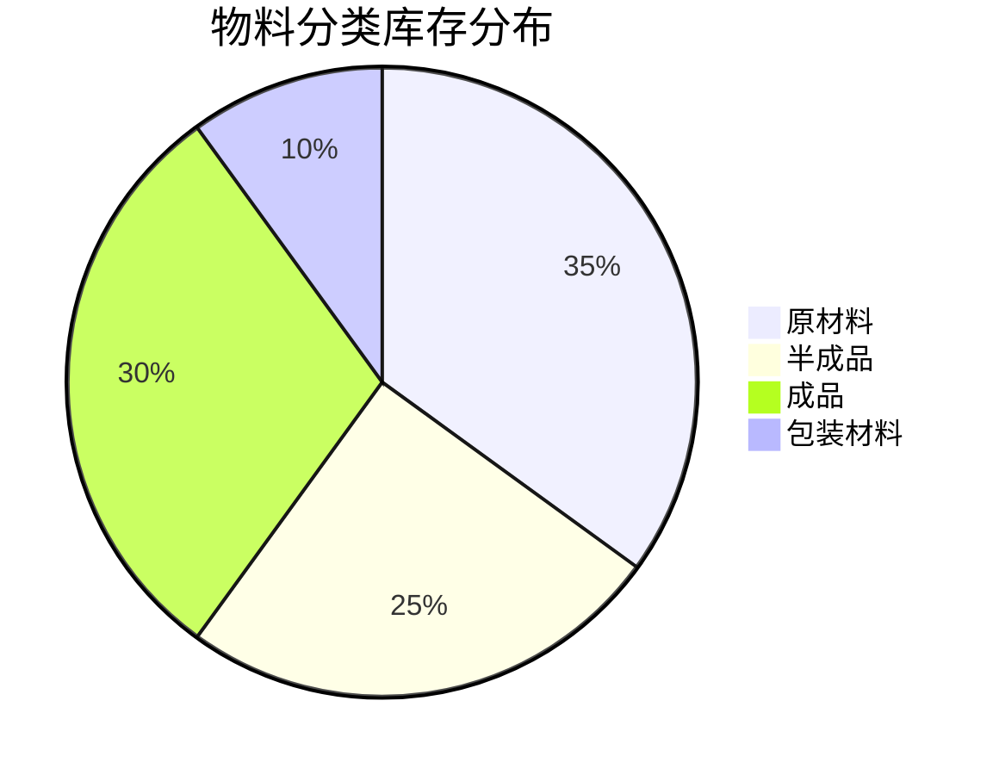
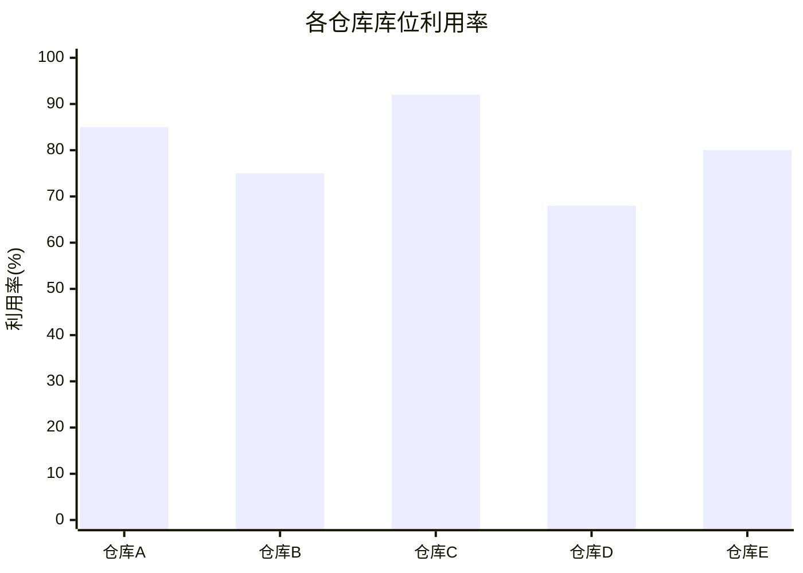

# 📊 WMS报表分析模块设计文档


## 📋 目录

- [模块概述](#模块概述)
- [功能设计](#功能设计)
- [数据模型](#数据模型)
- [报表类型](#报表类型)
- [图表展示](#图表展示)
- [接口设计](#接口设计)
- [前端界面](#前端界面)

## 🎯 模块概述

报表分析模块是WMS系统中提供数据统计、分析和可视化的功能模块，通过对系统中入库、出库、库存、批次等数据的多维度分析，为管理决策提供数据支持。该模块可以生成各类报表、图表，支持数据导出，帮助用户了解仓库运营状况，优化仓库管理策略。

### 核心功能

- 库存报表：库存状态报表、库存周转报表、库存预警报表等
- 作业报表：入库报表、出库报表、移库报表、盘点报表等
- 批次报表：批次库存报表、批次效期报表等
- 图表分析：库存趋势图、出入库对比图、库位利用率图等
- 报表导出：支持导出Excel、PDF等格式

## 🔍 功能设计

### 1. 库存报表

#### 功能描述

- 提供当前库存状态的多维度报表
- 统计库存周转率、周转天数等指标
- 分析库存积压和库存不足情况
- 支持按仓库、物料类别、库位等维度统计

#### 业务规则

- 库存周转率 = 销售成本 / 平均库存
- 库存周转天数 = 统计周期天数 / 库存周转率
- 库存预警标准：库存量 < 安全库存（欠库存）或 库存量 > 最高库存（超库存）
- 可按日、周、月、季、年进行统计

### 2. 作业报表

#### 功能描述

- 统计各类作业单据的数量和状态
- 分析入库、出库、移库等操作的时间和效率
- 计算各类作业的完成率、准确率等指标
- 支持按时间、物料、操作人等维度统计

#### 业务规则

- 入库完成率 = 已完成入库单数 / 总入库单数
- 出库准确率 = 准确出库数量 / 总出库数量
- 可按日、周、月、季、年进行统计
- 可按单据类型、状态进行筛选

### 3. 批次报表

#### 功能描述

- 统计批次库存分布情况
- 分析批次有效期和库存预警
- 追踪批次的入库、出库、库存变动历史
- 支持按批次属性、质量状态等维度统计

#### 业务规则

- 批次效期预警根据预设的天数进行标记
- 批次库存按质量状态分类统计
- 可追溯批次的完整流转历史
- 支持导出批次追溯报告

### 4. 图表分析

#### 功能描述

- 可视化展示库存趋势变化
- 图形化比较入库和出库数据
- 直观显示库位利用率和分布
- 支持多种图表类型：折线图、柱状图、饼图等

#### 业务规则

- 库存趋势图默认展示近30天数据
- 入出库对比图可选择日、周、月等时间维度
- 库位利用率 = 已使用库位数 / 总库位数
- 图表支持交互操作，如钻取、筛选等

### 5. 报表导出

#### 功能描述

- 支持将报表导出为Excel、PDF等格式
- 提供报表模板定制功能
- 支持报表自动发送邮件
- 支持报表的批量导出

#### 业务规则

- 导出报表保留原始格式和样式
- 导出文件命名规则：报表类型_日期时间
- 大数据量报表支持异步导出
- 自动发送的报表支持定时任务设置

## 📊 数据模型

### 1. 报表配置表(wms_report_config)

| 字段名 | 数据类型 | 是否必填 | 描述 |
|-------|---------|---------|------|
| id | bigint(20) | 是 | 主键ID |
| report_code | varchar(64) | 是 | 报表编码 |
| report_name | varchar(255) | 是 | 报表名称 |
| report_type | tinyint(4) | 是 | 报表类型 |
| report_desc | varchar(512) | 否 | 报表描述 |
| sql_template | text | 是 | SQL模板 |
| params_config | text | 否 | 参数配置(JSON) |
| columns_config | text | 是 | 列配置(JSON) |
| chart_config | text | 否 | 图表配置(JSON) |
| status | tinyint(4) | 是 | 状态 |
| sort | int(11) | 是 | 排序 |
| remark | varchar(512) | 否 | 备注 |
| creator | varchar(64) | 是 | 创建人 |
| create_time | datetime | 是 | 创建时间 |
| updater | varchar(64) | 是 | 更新人 |
| update_time | datetime | 是 | 更新时间 |
| deleted | bit(1) | 是 | 是否删除 |
| tenant_id | bigint(20) | 是 | 租户编号 |

### 2. 报表模板表(wms_report_template)

| 字段名 | 数据类型 | 是否必填 | 描述 |
|-------|---------|---------|------|
| id | bigint(20) | 是 | 主键ID |
| template_code | varchar(64) | 是 | 模板编码 |
| template_name | varchar(255) | 是 | 模板名称 |
| template_type | tinyint(4) | 是 | 模板类型 |
| file_path | varchar(255) | 是 | 文件路径 |
| report_id | bigint(20) | 否 | 关联报表ID |
| mapping_config | text | 否 | 映射配置(JSON) |
| status | tinyint(4) | 是 | 状态 |
| remark | varchar(512) | 否 | 备注 |
| creator | varchar(64) | 是 | 创建人 |
| create_time | datetime | 是 | 创建时间 |
| updater | varchar(64) | 是 | 更新人 |
| update_time | datetime | 是 | 更新时间 |
| deleted | bit(1) | 是 | 是否删除 |
| tenant_id | bigint(20) | 是 | 租户编号 |

### 3. 报表任务表(wms_report_task)

| 字段名 | 数据类型 | 是否必填 | 描述 |
|-------|---------|---------|------|
| id | bigint(20) | 是 | 主键ID |
| task_name | varchar(255) | 是 | 任务名称 |
| report_id | bigint(20) | 是 | 报表ID |
| report_name | varchar(255) | 是 | 报表名称 |
| task_type | tinyint(4) | 是 | 任务类型 |
| cron_expression | varchar(64) | 是 | Cron表达式 |
| params_value | text | 否 | 参数值(JSON) |
| output_type | varchar(32) | 是 | 输出类型 |
| email_to | varchar(255) | 否 | 接收邮箱 |
| email_cc | varchar(255) | 否 | 抄送邮箱 |
| email_subject | varchar(255) | 否 | 邮件主题 |
| email_content | text | 否 | 邮件内容 |
| status | tinyint(4) | 是 | 状态 |
| last_execute_time | datetime | 否 | 上次执行时间 |
| next_execute_time | datetime | 否 | 下次执行时间 |
| remark | varchar(512) | 否 | 备注 |
| creator | varchar(64) | 是 | 创建人 |
| create_time | datetime | 是 | 创建时间 |
| updater | varchar(64) | 是 | 更新人 |
| update_time | datetime | 是 | 更新时间 |
| deleted | bit(1) | 是 | 是否删除 |
| tenant_id | bigint(20) | 是 | 租户编号 |

## 📑 报表类型

### 1. 库存报表

#### 库存状态报表

- **报表描述**：展示当前库存状态的详细信息
- **维度字段**：仓库、物料分类、物料、库位、批次等
- **指标字段**：库存数量、可用数量、锁定数量等
- **筛选条件**：仓库、物料分类、物料编码、库存状态等
- **排序规则**：默认按仓库、物料编码排序

#### 库存周转报表

- **报表描述**：分析物料的库存周转情况
- **维度字段**：物料分类、物料、仓库等
- **指标字段**：期初库存、期末库存、出库数量、库存周转率、周转天数等
- **筛选条件**：时间范围、物料分类、物料编码等
- **排序规则**：默认按周转率降序排序

#### 库存预警报表

- **报表描述**：展示库存预警（超库存/欠库存）情况
- **维度字段**：物料分类、物料、仓库等
- **指标字段**：当前库存、安全库存、最高库存、预警状态等
- **筛选条件**：预警类型、物料分类、物料编码等
- **排序规则**：默认按预警级别降序排序

### 2. 作业报表

#### 入库报表

- **报表描述**：统计入库单据和入库数量情况
- **维度字段**：入库类型、仓库、物料、供应商、时间等
- **指标字段**：入库单数、计划数量、实际数量、完成率等
- **筛选条件**：时间范围、入库类型、仓库、入库状态等
- **排序规则**：默认按入库时间降序排序

#### 出库报表

- **报表描述**：统计出库单据和出库数量情况
- **维度字段**：出库类型、仓库、物料、客户、时间等
- **指标字段**：出库单数、计划数量、实际数量、完成率等
- **筛选条件**：时间范围、出库类型、仓库、出库状态等
- **排序规则**：默认按出库时间降序排序

#### 移库报表

- **报表描述**：统计库内移动情况
- **维度字段**：移动类型、仓库、物料、时间等
- **指标字段**：移动单数、移动数量等
- **筛选条件**：时间范围、移动类型、仓库等
- **排序规则**：默认按移动时间降序排序

#### 盘点报表

- **报表描述**：统计盘点结果和差异情况
- **维度字段**：盘点类型、仓库、物料、时间等
- **指标字段**：盘点单数、系统数量、盘点数量、盘盈数量、盘亏数量等
- **筛选条件**：时间范围、盘点类型、仓库、盘点状态等
- **排序规则**：默认按盘点时间降序排序

### 3. 批次报表

#### 批次库存报表

- **报表描述**：展示批次库存的详细信息
- **维度字段**：批次号、物料、仓库、库位等
- **指标字段**：库存数量、可用数量、锁定数量等
- **筛选条件**：批次号、物料编码、仓库、批次状态等
- **排序规则**：默认按批次创建时间降序排序

#### 批次效期报表

- **报表描述**：分析批次的效期情况
- **维度字段**：批次号、物料、仓库、生产日期、有效期等
- **指标字段**：库存数量、剩余有效期(天)、效期状态等
- **筛选条件**：效期状态、物料编码、仓库等
- **排序规则**：默认按剩余有效期升序排序

## 📈 图表展示

### 库存趋势图

```mermaid
xychart-beta
    title "物料库存趋势(近30天)"
    x-axis [10/1, 10/5, 10/10, 10/15, 10/20, 10/25, 10/30]
    y-axis "库存数量" 0 --> 1000
    bar [650, 730, 800, 720, 680, 750, 820]
    line [650, 730, 800, 720, 680, 750, 820]
```

### 入出库对比图

```mermaid
xychart-beta
    title "入出库数量对比(近30天)"
    x-axis [10/1, 10/5, 10/10, 10/15, 10/20, 10/25, 10/30]
    y-axis "数量" 0 --> 500
    bar [320, 280, 250, 300, 270, 320, 350]
    bar [280, 250, 220, 290, 300, 280, 310]
    line [320, 280, 250, 300, 270, 320, 350]
    line [280, 250, 220, 290, 300, 280, 310]
```

### 库存分布饼图



### 库位利用率图



## 🔌 接口设计

### 1. 报表配置接口

#### 获取报表列表

- **接口路径**: `/wms/report/page`
- **请求方式**: GET
- **请求参数**:
  - reportCode: 报表编码（可选）
  - reportName: 报表名称（可选）
  - reportType: 报表类型（可选）
  - status: 状态（可选）
  - pageNo: 页码（必填）
  - pageSize: 每页记录数（必填）
- **响应结果**: 分页返回报表列表

#### 获取报表详情

- **接口路径**: `/wms/report/get`
- **请求方式**: GET
- **请求参数**:
  - id: 报表ID（必填）
- **响应结果**: 返回报表详情

#### 创建报表配置

- **接口路径**: `/wms/report/create`
- **请求方式**: POST
- **请求参数**:
  ```json
  {
    "reportCode": "INVENTORY_STATUS",
    "reportName": "库存状态报表",
    "reportType": 1,
    "reportDesc": "展示当前库存状态的详细信息",
    "sqlTemplate": "SELECT * FROM wms_inventory WHERE status = #{status}",
    "paramsConfig": "[{\"name\":\"status\",\"label\":\"状态\",\"type\":\"select\",\"options\":[{\"label\":\"正常\",\"value\":0},{\"label\":\"锁定\",\"value\":1}]}]",
    "columnsConfig": "[{\"field\":\"item_code\",\"title\":\"物料编码\"},{\"field\":\"item_name\",\"title\":\"物料名称\"},{\"field\":\"warehouse_name\",\"title\":\"仓库\"},{\"field\":\"stock_count\",\"title\":\"库存数量\"}]",
    "chartConfig": null,
    "status": 0,
    "sort": 1,
    "remark": "库存状态报表"
  }
  ```
- **响应结果**: 创建成功返回报表ID

### 2. 报表查询接口

#### 执行报表查询

- **接口路径**: `/wms/report/execute`
- **请求方式**: POST
- **请求参数**:
  ```json
  {
    "reportId": 1,
    "params": {
      "status": 0,
      "warehouseId": 1,
      "startDate": "2023-01-01",
      "endDate": "2023-01-31"
    },
    "pageNo": 1,
    "pageSize": 20
  }
  ```
- **响应结果**: 返回报表执行结果数据

#### 获取图表数据

- **接口路径**: `/wms/report/chart`
- **请求方式**: POST
- **请求参数**:
  ```json
  {
    "reportId": 1,
    "chartType": "line",
    "params": {
      "startDate": "2023-01-01",
      "endDate": "2023-01-31"
    }
  }
  ```
- **响应结果**: 返回图表所需的数据

### 3. 报表导出接口

#### 导出报表

- **接口路径**: `/wms/report/export`
- **请求方式**: POST
- **请求参数**:
  ```json
  {
    "reportId": 1,
    "params": {
      "status": 0,
      "warehouseId": 1,
      "startDate": "2023-01-01",
      "endDate": "2023-01-31"
    },
    "exportType": "excel",
    "templateId": null
  }
  ```
- **响应结果**: 返回文件下载链接

### 4. 报表任务接口

#### 创建报表任务

- **接口路径**: `/wms/report-task/create`
- **请求方式**: POST
- **请求参数**:
  ```json
  {
    "taskName": "每日库存报表",
    "reportId": 1,
    "reportName": "库存状态报表",
    "taskType": 1,
    "cronExpression": "0 0 8 * * ?",
    "paramsValue": "{\"status\":0}",
    "outputType": "excel",
    "emailTo": "example@example.com",
    "emailSubject": "每日库存报表",
    "emailContent": "附件为每日库存报表，请查收",
    "status": 0,
    "remark": "每天早上8点自动发送"
  }
  ```
- **响应结果**: 创建成功返回任务ID

## 💻 前端界面

### 1. 报表中心主页

- **功能说明**:
  - 报表分类区：显示报表分类树，如库存报表、作业报表、批次报表等
  - 报表列表区：显示当前分类下的报表列表
  - 常用报表区：显示用户常用的报表快捷入口
  - 个人收藏区：显示用户收藏的报表
  - 最近查看区：显示用户最近查看的报表历史

### 2. 报表查询页面

- **功能说明**:
  - 查询条件区：根据报表配置动态生成查询条件表单
  - 数据表格区：显示报表查询结果，支持排序、筛选
  - 图表展示区：以图表形式展示数据，支持多种图表类型切换
  - 操作按钮区：提供导出、打印、保存等操作
  - 分页控件：控制分页显示

### 3. 报表配置页面

- **功能说明**:
  - 基本信息配置：设置报表名称、编码、类型等基本信息
  - SQL模板配置：编写和测试SQL查询语句
  - 参数配置：设置查询参数的名称、类型、默认值等
  - 列配置：设置显示字段、字段标题、格式化规则等
  - 图表配置：设置图表类型、数据映射、样式等
  - 预览区：实时预览报表效果

### 4. 报表任务页面

- **功能说明**:
  - 任务列表：显示已配置的报表定时任务
  - 任务配置：设置任务名称、执行周期、输出方式等
  - 邮件配置：设置接收邮箱、邮件主题、邮件内容等
  - 执行记录：显示任务的执行历史和状态
  - 操作按钮：启用/禁用、编辑、删除等操作

### 5. 报表模板页面

- **功能说明**:
  - 模板列表：显示已配置的报表导出模板
  - 模板上传：上传Excel模板文件
  - 映射配置：设置模板字段与报表数据的映射关系
  - 预览区：预览模板应用效果
  - 操作按钮：应用模板、编辑、删除等操作 